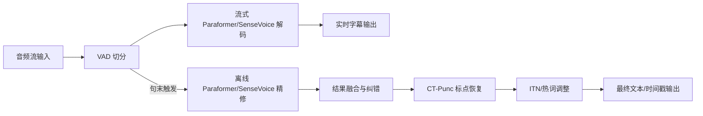
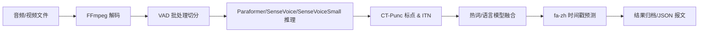

# FunASR 系统技术架构说明

本说明面向需要快速理解 FunASR 项目形态的研发与运维人员，梳理平台各层级组件、核心链路与部署模式，并配套系统架构流程图以帮助建立整体认知。

## 1. 项目概览
- **平台定位**：FunASR 提供覆盖语音端点检测（VAD）、流式/离线语音识别、标点恢复、语言模型、说话人识别与情感识别等工业级能力，结合模型训练、推理与部署工具形成一体化语音技术栈。
- **模型生态**：项目维护大规模模型库，核心模型如 Paraformer、SenseVoice、FSMN-VAD、CT-Punc、fa-zh 时间戳与 emotion2vec+ 系列均可通过 ModelScope/HuggingFace 获取。
- **产品形态**：提供 Python SDK（`AutoModel`）、命令行工具与 Runtime 部署脚本，支持实时转写、离线文件转写及多语言 2pass 协同推理服务。

## 2. 系统架构总览

```mermaid
flowchart TB
    subgraph App[应用接入层]
        WebClient[Web/HTML 客户端]
        WsClient[WebSocket/gRPC 客户端]
        BatchJob[批量任务脚本]
    end

    subgraph Runtime[服务编排层 (runtime)]
        Gateway[接入网关 / Session 管理]
        Pipeline[推理编排器]
        ResourceMgr[模型与热词管理]
    end

    subgraph Components[推理组件层]
        VAD[FSMN-VAD 端点检测]
        ASRStream[Paraformer/SenseVoice 流式 ASR]
        ASROffline[Paraformer/SenseVoice 离线 ASR]
        Punc[CT-Punc 标点 & ITN]
        Timestamp[fa-zh 时间戳]
        Emotion[emotion2vec+ 情感]
    end

    subgraph SDK[SDK 与 CLI]
        AutoModel[AutoModel 推理调度]
        Exporter[模型导出 / CLI]
    end

    subgraph Models[模型资源层]
        ModelScope[ModelScope/HuggingFace 模型仓库]
        LocalModel[本地微调模型]
    end

    App --> Gateway
    Gateway --> Pipeline
    Pipeline --> VAD
    Pipeline --> ASRStream
    Pipeline --> ASROffline
    Pipeline --> Punc
    Pipeline --> Timestamp
    Pipeline --> Emotion
    Pipeline --> ResourceMgr
    ResourceMgr --> Models
    Components --> Runtime
    Runtime --> App
    SDK --> Pipeline
    SDK --> Components
    Models --> SDK
```

**说明**：
1. 应用通过 WebSocket/gRPC 或批处理脚本接入 runtime，由接入网关维护会话、鉴权与流式缓存。
2. 推理编排器根据模式（online/offline/2pass）调度 VAD、ASR、标点与增值组件，热词与模型版本由资源管理模块负责。
3. Python SDK 与 CLI 既可直接调用推理组件，也可将模型导出为 ONNX/Runtime 形态复用到服务层，实现“同模型多形态”架构。

## 3. 模块分层与职责

| 层级 | 关键目录/模块 | 核心职责 | 关键能力 |
| --- | --- | --- | --- |
| 模型与数据层 | `model_zoo/`, `examples/` | 提供模型清单与训练/推理范例，涵盖多语言 ASR、VAD、标点、情感等任务 | ModelScope/HuggingFace 拉取、离线/流式范例脚本 |
| 推理 SDK 层 | `funasr/`, `fun_text_processing/` | `AutoModel` 统一加载 ASR/VAD/PUNC 等模型，支持动态批处理与组合推理 | 命令行 `funasr`、Python API、模型导出能力 |
| 服务编排层 | `runtime/` | 提供实时/离线/2pass 服务脚本、Docker 镜像与客户端示例，支持热词、时间戳、SSL | 在线/离线部署教程、性能优化、并发调度 |
| 体验与运维层 | `web-pages/`, `runtime/docs/`, `tests/` | Web 演示、运维手册、自动化测试保障 | 多语言客户端、运维脚本、CI 用例覆盖 |

## 4. 实时语音服务（2pass）流程



- `online` 模式仅走流式链路，`2pass` 模式在句尾追加离线精修并融合结果，以兼顾低延迟与高精度。
- 热词、时间戳模型及 SSL 配置可按需加载，满足定制化与安全要求。

## 5. 离线文件转写服务流程



- 支持批量长音频转写，结合 FFmpeg 适配多格式输入并在 runtime 中提供动态批处理与多线程调度以提升吞吐。
- 可按需启用热词文件、ITN 和时间戳模型，生成带时间轴的富文本结果。

## 6. SDK 交互与使用范式
- **统一入口**：`AutoModel` 通过配置 `model/vad_model/punc_model` 参数组合多模型链路，适配流式、离线及多语种识别场景。
- **动态批处理**：`batch_size_s` 控制批内总时长，可在离线脚本与 SDK 中兼顾吞吐与延迟。
- **模型导出**：`funasr-export` 或 `AutoModel.export()` 支持生成 ONNX/Runtime 模型，便于与 C++/Java 客户端协同部署。

## 7. 部署形态与运维要点
- **实时服务包**：`funasr-runtime-deploy-online-cpu-zh.sh` 提供一键部署、启动、热词更新与 SSL 管理，适合字幕、会议纪要等低延迟场景。
- **离线转写服务**：`funasr-runtime-deploy-offline-cpu-zh.sh`/GPU 版本支持长音频批量处理、动态批量与多线程加速。
- **多端客户端**：官方提供 Python、C++、Java 与 Web 演示客户端，便于接入测试与二次开发。
- **运维操作**：部署脚本内置 `start/stop/restart/update` 等命令，热词文件与模型版本可在线热更新，满足持续运营需求。

## 8. 扩展与最佳实践
- **模型迭代**：依托 ModelScope/HuggingFace 模型仓库，支持下载官方更新或加载自有微调模型，保持模型快速演进。
- **多任务组合**：在 runtime 中可按需接入情感识别、说话人识别等模型，为智能客服、语音理解场景提供结构化输出。
- **跨平台部署**：官方镜像覆盖 CPU/GPU/ARM64，命令行及 SDK 支持 Linux/Windows，满足多环境交付需求。
