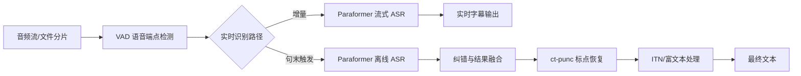

# FunASR 技术全景与实战手册

## 1. 平台总览
FunASR 由阿里达摩院语音实验室推出，目标是打通学术研究与工业落地之间的通道，提供覆盖训练、推理、微调与服务部署的一站式语音技术平台。核心能力包括：语音识别（ASR）、流式与离线识别、语音端点检测（VAD）、标点恢复（PUNC）、语言模型（LM）、说话人识别/分离以及情感识别等，配套提供了丰富的预训练模型与部署脚本，可快速搭建工业级语音应用。 

## 2. 能力矩阵
| 功能模块 | 关键模型/组件 | 主要说明 | SDK 入口 |
| --- | --- | --- | --- |
| 语音端点检测（VAD） | `fsmn-vad` | 切分长语音、支持流式与离线调用，输出有效语音片段时间戳。 | Python `AutoModel`、Runtime SDK |
| 语音识别（离线） | `paraformer-zh`、`SenseVoiceSmall`、`Whisper-large-v3` 等 | 高精度非流式 ASR，可结合 VAD、PUNC、热词与时间戳模型构建完整链路。 | Python `AutoModel`、Runtime 离线服务 |
| 语音识别（流式） | `paraformer-zh-streaming` | 低延迟流式识别，支持 chunk 配置、缓存增量推理。 | Python `AutoModel`、Runtime 实时服务 |
| 纠错与富文本输出 | 2pass 离线 ASR、`ct-punc`、ITN | 实时服务句末触发离线 ASR 纠错，结合标点恢复与逆文本标准化输出可读文本。 | Runtime 实时服务 `2pass` 模式 |
| 标点恢复 | `ct-punc` | 对文本插入中英文标点，提升可读性。 | Python `AutoModel`、Runtime 链路 |
| 热词/定制词表 | 热词 FST | 支持在转写时引入自定义词与权重，提升专有名词命中率。 | Runtime 离线/实时服务 |
| 时间戳预测 | `fa-zh` | 基于文本与音频预测对齐时间戳。 | Python `AutoModel` |
| 情感识别 | `emotion2vec_plus_large` 等 | 针对语音的情感分类与特征抽取。 | Python `AutoModel` |

## 3. 核心处理流程
### 3.1 实时语音识别 + 纠错 + 自动标点
FunASR 实时转写服务通过 WebSocket 或 gRPC 提供流式识别，支持 `mode=online`（纯流式）与 `mode=2pass`（流式+纠错）两种模式。`2pass` 在句尾触发离线 Paraformer 模型进行高精度纠错，同时结合标点与 ITN，确保输出文本的准确度与可读性。服务器可选一键部署脚本 `funasr-runtime-deploy-online-cpu-zh.sh`，支持热词、时间戳模型加载与 SSL 配置。



### 3.2 离线文件转写链路
离线服务适用于长音频/视频转写，可通过 `funasr-runtime-deploy-offline-cpu-zh.sh` 一键部署。服务内置 FFmpeg 适配多种音视频格式，支持批量转写、热词、时间戳与 ITN。


## 4. FunASR Python SDK 使用
### 4.1 `AutoModel` 快速上手
- **多功能非流式识别**：
  ```python
  from funasr import AutoModel
  model = AutoModel(model="paraformer-zh", vad_model="fsmn-vad", punc_model="ct-punc")
  res = model.generate(input=f"{model.model_path}/example/asr_example.wav", batch_size_s=300, hotword="魔搭")
  ```
  支持在推理时加载 VAD、标点模型与热词，自由组合完整识别链路。

- **SenseVoice 多语种识别**：
  ```python
  from funasr import AutoModel
  from funasr.utils.postprocess_utils import rich_transcription_postprocess
  model = AutoModel(model="iic/SenseVoiceSmall", vad_model="fsmn-vad", vad_kwargs={"max_single_segment_time": 30000}, device="cuda:0")
  res = model.generate(input=f"{model.model_path}/example/en.mp3", cache={}, language="auto", use_itn=True, batch_size_s=60, merge_vad=True, merge_length_s=15)
  text = rich_transcription_postprocess(res[0]["text"])
  ```
  通过 `vad_kwargs`、`use_itn` 等参数控制语音切分与文本规范化。

- **流式识别**：
  ```python
  from funasr import AutoModel
  import soundfile, os
  chunk_size = [0, 10, 5]
  model = AutoModel(model="paraformer-zh-streaming")
  wav_file = os.path.join(model.model_path, "example/asr_example.wav")
  speech, sample_rate = soundfile.read(wav_file)
  chunk_stride = chunk_size[1] * 960
  cache = {}
  total_chunk_num = int((len(speech) - 1) / chunk_stride + 1)
  for i in range(total_chunk_num):
      speech_chunk = speech[i*chunk_stride:(i+1)*chunk_stride]
      is_final = i == total_chunk_num - 1
      res = model.generate(input=speech_chunk, cache=cache, is_final=is_final, chunk_size=chunk_size,
                           encoder_chunk_look_back=4, decoder_chunk_look_back=1)
      print(res)
  ```
  通过 `chunk_size`、`cache`、`is_final` 控制流式缓存与输出节奏。

### 4.2 核心子模块调用
- **VAD**：`AutoModel(model="fsmn-vad")` 支持离线与流式输出语音区间，流式模式会输出 `[beg, -1]` 等提示当前检测状态。
- **标点恢复**：`AutoModel(model="ct-punc")` 为中英混合文本补全标点。
- **时间戳预测**：结合音频与对应文本 `AutoModel(model="fa-zh")` 输出对齐时间。
- **情感识别**：`AutoModel(model="emotion2vec_plus_large")` 可按语句或帧级输出情感标签。

### 4.3 命令行与模型导出
- **命令行转写**：`funasr ++model=paraformer-zh ++vad_model="fsmn-vad" ++punc_model="ct-punc" ++input=asr_example_zh.wav`
- **ONNX 导出**：
  ```shell
  funasr-export ++model=paraformer ++quantize=false ++device=cpu
  ```
  或在 Python 中调用 `AutoModel(...).export(quantize=False)`，便于在 ONNX Runtime 中部署。

## 5. Runtime SDK 操作手册
### 5.1 运行环境规划
- X86 4 核 vCPU + 8 GB 内存：约 32 路并发。
- X86 16 核 vCPU + 32 GB 内存：约 64 路并发。
- X86 64 核 vCPU + 128 GB 内存：约 200 路并发。

### 5.2 一键部署流程
1. 下载部署脚本（示例为实时服务）：
   ```shell
   curl -O https://raw.githubusercontent.com/alibaba-damo-academy/FunASR/main/runtime/deploy_tools/funasr-runtime-deploy-online-cpu-zh.sh
   sudo bash funasr-runtime-deploy-online-cpu-zh.sh install --workspace ./funasr-runtime-resources
   ```
   在安装过程中选择 ASR/VAD/PUNC 模型，若需热词或时间戳模型，可在步骤提示中选择对应编号，并在 `hotwords.txt` 中配置 `词 权重`。

2. 离线转写脚本使用 `funasr-runtime-deploy-offline-cpu-zh.sh`，流程与实时服务一致，同样支持 FFmpeg、热词与时间戳模型选项。

### 5.3 客户端调用
- **Python WebSocket 客户端**：
  ```shell
  python3 funasr_wss_client.py --host 127.0.0.1 --port 10095 --mode 2pass --audio_in ../audio/asr_example.pcm --hotword hotwords.txt --use_itn 1
  ```
  `mode` 支持 `offline`、`online`、`2pass`；`chunk_size` 可调节流式延迟；`ssl` 控制证书校验。

- **C++ 客户端**：`./funasr-wss-client-2pass --server-ip 127.0.0.1 --port 10095 --wav-path ../audio/asr_example.pcm`

- **Web/Java 客户端**：提供 `html/static/index.html` 与 `FunasrWsClient` 示例，可按需扩展。

### 5.4 服务运维
- 启动：`sudo bash funasr-runtime-deploy-online-cpu-zh.sh start`
- 停止：`sudo bash funasr-runtime-deploy-online-cpu-zh.sh stop`
- 重启：`sudo bash funasr-runtime-deploy-online-cpu-zh.sh restart`
- 卸载：`sudo bash funasr-runtime-deploy-online-cpu-zh.sh remove`
- 更新模型或参数：
  ```shell
  sudo bash funasr-runtime-deploy-online-cpu-zh.sh update --asr_model <model_id>
  sudo bash funasr-runtime-deploy-online-cpu-zh.sh update --decode_thread_num 32
  sudo bash funasr-runtime-deploy-online-cpu-zh.sh update --ssl 0
  ```

### 5.5 模型与热词管理
- 模型可直接填入 ModelScope ID 或本地路径。
- 热词文件位于部署工作目录 `hotwords.txt`，格式为 `词 权重`，支持实时更新。
- ITN（Inverse Text Normalization）通过 `--use_itn` 或客户端参数启用，适合数值、日期等格式化输出。

## 6. 模型资源与选型建议
| 模型 | 任务 | 语言/数据 | 规模 |
| --- | --- | --- | --- |
| SenseVoiceSmall | 多任务语音理解（ASR/ITN/LID/SER/AED） | 多语种，约 30 万小时 | 234 M |
| paraformer-zh / paraformer-zh-streaming | 普通话 ASR（离线/流式） | 6 万小时普通话 | 220 M |
| paraformer-en | 英文 ASR | 5 万小时英文 | 220 M |
| ct-punc | 中英标点恢复 | 1 亿句双语数据 | 290 M |
| fsmn-vad | 端点检测 | 5 千小时中英混合 | 0.4 M |
| fa-zh | 时间戳预测 | 5 千小时普通话 | 38 M |
| Whisper-large-v3(-turbo) | 多语种 ASR+翻译 | 多语种 | 809–1550 M |
| emotion2vec+ 系列 | 语音情感识别 | 4 万小时 | 300 M |
根据场景选择：实时字幕推荐 `paraformer-zh-streaming + 2pass`；多语种场景可使用 `SenseVoiceSmall` 或 `Whisper`；需情感分析时叠加 `emotion2vec+`。

## 7. 扩展能力与最佳实践
- **动态批处理**：`batch_size_s` 控制批量总时长，实现吞吐与延迟折中。
- **多并发调度**：Runtime 支持配置 `--decode_thread_num`、`--io_thread_num`，按 CPU/GPU 能力扩展并发。
- **安全通信**：部署脚本默认开启 SSL，可通过 `--ssl 0` 关闭或配置证书。
- **容器化部署**：官方提供 Docker 镜像，可在云服务器中快速启动，支持 ARM64。

## 8. 参考资料
- FunASR README：模型与 SDK 使用示例、模型导出指南。
- Runtime Roadmap：覆盖离线/实时服务能力与版本记录。
- SDK Tutorial（离线/实时）：一键部署脚本、客户端参数、运维命令详解。
