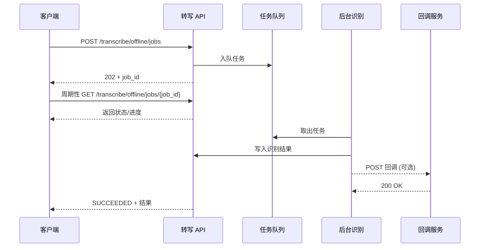
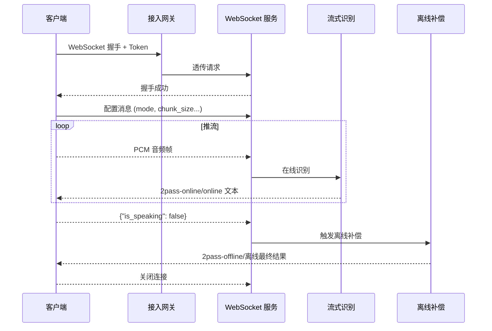

# 智能语音识别服务接口说明

## 1. 概述
本文档描述智能语音识别服务提供的两类接口：
- REST 离线识别接口：适用于整段音频文件的批量转写。
- WebSocket 实时识别接口：适用于流式音频的实时字幕或会议记录场景。

服务端默认提供 HTTPS/WSS 访问方式，建议通过网关提供统一的域名与版本化路径，例如 `https://voicehub.example.com/v1`。

## 2. 鉴权机制
- **令牌类型**：Bearer Token（建议使用短期有效的 JWT 或与网关共享的访问令牌）。
- **携带方式**：
  - REST 请求：`Authorization: Bearer <token>`。
  - WebSocket 握手：推荐将同名 Header 透传至后端；若受限于客户端能力，可通过查询串 `?token=<token>` 携带，并在升级前验证。
- **校验逻辑**：
  1. 解析并验证令牌签名、有效期与受众（audience）。
  2. 拒绝黑名单或被吊销的令牌。
  3. 未通过校验时返回 / 发送：
     - REST：`401 Unauthorized`，响应体 `{ "code": 40101, "message": "invalid token" }`。
     - WebSocket：拒绝升级请求或在首次消息后关闭，错误码 4401。

> **建议**：在入口服务加入速率限制与 IP 白名单，配合审计日志，满足安全与合规要求。

## 3. REST 离线识别接口

### 3.1 Endpoint 一览
| 方法 | 路径                                          | 说明               |
|------|-----------------------------------------------|--------------------|
| POST | `/v1/transcribe/offline/jobs`*             | 创建离线识别任务     |
| GET  | `/v1/transcribe/offline/jobs/{job_id}`     | 查询任务状态与结果   |
| POST | `/v1/transcribe/offline/jobs/{job_id}/cancel`（可选） | 取消排队或执行中的任务 |

> `*` 若复用当前 FastAPI 服务，可保留 `/recognition` 作为内部实现，通过 API 网关映射到 `/v1/transcribe/offline/jobs` 并引入消息队列。

### 3.2 创建任务（POST `/v1/transcribe/offline/jobs`）
- **Headers**
  - `Authorization: Bearer <token>`（必填）
  - `Content-Type: multipart/form-data`
  - `X-Request-ID`（可选，用于链路追踪）
- **Body（multipart）**
  - `audio`（必填）：音频文件，支持 `wav`, `mp3`, `m4a`, `aac`, `flac` 等，大小建议 ≤ 50 MB。
  - `client_meta`（可选）：JSON 字符串，承载业务上下文。
  - `callback_url`（可选）：识别完成后回调的 HTTPS 地址。
  - `priority`（可选）：整数，越大优先级越高，用于任务队列调度。

服务器接收到请求后解码基本元信息，将原始音频内容与任务参数写入对象存储或临时目录，并将任务指针放入队列。返回值立即给出任务 ID，后续由后台工作线程消费任务，支持水平扩展处理并发。

**同步响应示例**（HTTP 202）：
```json
{
  "code": 0,
  "job_id": "job-20250121-001",
  "status": "QUEUED",
  "queue_position": 3,
  "request_id": "20250121-7f25e..."
}
```

### 3.3 查询任务（GET `/v1/transcribe/offline/jobs/{job_id}`）
返回任务状态、进度以及在完成时的识别结果。

```json
{
  "code": 0,
  "job_id": "job-20250121-001",
  "status": "SUCCEEDED",
  "progress": 1.0,
  "submitted_at": "2025-01-21T06:01:18Z",
  "completed_at": "2025-01-21T06:02:04Z",
  "result": {
    "text": "欢迎使用语音识别服务。",
    "sentences": [
      {
        "text": "欢迎使用语音识别服务。",
        "start": 0.52,
        "end": 3.08
      }
    ],
    "meta": {
      "language": "zh-CN",
      "audio_duration": 3.6
    }
  }
}
```

常见状态：
- `QUEUED`：等待调度。
- `PROCESSING`：后台正在识别。
- `SUCCEEDED`：识别完成，可读取 `result`。
- `FAILED`：识别失败，`error` 字段给出原因。
- `CANCELLED`：任务被主动取消。

### 3.4 回调机制
- 创建任务时提供 `callback_url` 即可启用。
- 任务完成或失败时，服务端向该地址发送 POST 请求，正文结构与查询接口 `result` 字段一致，并附带签名 Header（例如 `X-Signature`）。
- 建议实现幂等：客户端需返回 `2xx` 表示接收成功，否则服务端可按指数退避重试，默认最多 5 次。

### 3.5 业务校验与并发控制
- 音频统一解码为单声道 16 kHz 16-bit PCM；若解码失败返回 `400`。
- 通过队列与工作线程池支撑高并发：
  - 支持配置最大排队长度，超过阈值返回 `429`。
  - 工作线程数量可按 CPU/GPU 核心数动态调整。
- 建议在 `progress` 字段中提供 0~1 的当前进度，便于前端轮询展示。
- 默认启用句级时间戳，可在任务参数中附加 `enable_sentence_timestamp=false` 关闭。

### 3.6 任务取消（可选）
- 当任务仍处于 `QUEUED` 或 `PROCESSING` 状态且支持取消时，调用 `POST /v1/transcribe/offline/jobs/{job_id}/cancel`，返回：
```json
{
  "code": 0,
  "job_id": "job-20250121-001",
  "status": "CANCELLED"
}
```

### 3.7 错误码
| HTTP | code  | message              | 说明                          |
|------|-------|----------------------|-------------------------------|
| 400  | 40001 | invalid audio format | 不支持的音频编码或采样率异常 |
| 401  | 40101 | invalid token        | 令牌缺失、过期或校验失败      |
| 413  | 41301 | payload too large    | 音频文件超过配置的最大限制    |
| 429  | 42901 | rate limit exceeded  | 排队溢出或触发限流            |
| 500  | 50001 | internal error       | 转写流程内部异常              |
| 504  | 50401 | job timeout          | 后端处理超时                  |

### 3.8 调用示例
```bash
# 1. 提交任务
curl -X POST "https://voicehub.example.com/v1/transcribe/offline/jobs" \
  -H "Authorization: Bearer $TOKEN" \
  -F "audio=@/path/to/sample.wav" \
  -F 'client_meta={"channel":"support"}' \
  -F "callback_url=https://app.example.com/voice/callback"

# 2. 查询状态
curl -X GET "https://voicehub.example.com/v1/transcribe/offline/jobs/job-20250121-001" \
  -H "Authorization: Bearer $TOKEN"
```

### 3.9 调用流程示意


## 4. WebSocket 实时识别接口

### 4.1 握手与路径
- URL：`wss://voicehub.example.com/v1/transcribe/ws`
- Header：`Authorization: Bearer <token>`
- 协议：二进制子协议 `binary`（与现有实现保持一致）。
- 服务端验证令牌后允许升级；未通过则返回 401。

### 4.2 消息类型
1. **配置消息（JSON）**：连接建立后需先发送，字段说明如下：
   | 字段 | 类型 | 是否必选 | 说明 |
   |------|------|----------|------|
   | `mode` | string | 否 | `online`、`offline`、`2pass`，默认 `2pass` |
   | `chunk_size` | array[int, int, int] | 否 | 识别窗口配置，默认 `[5,10,5]` |
   | `chunk_interval` | int | 否 | 音频分片间隔毫秒（默认 10） |
   | `encoder_chunk_look_back` | int | 否 | 流式模型编码窗口回溯 |
   | `decoder_chunk_look_back` | int | 否 | 流式模型解码回溯 |
   | `audio_fs` | int | 否 | 音频采样率，默认 16000 |
   | `wav_name` | string | 否 | 会话标识，默认 `microphone` |
   | `is_speaking` | bool | 是 | 首次应为 `true`，表示开始推流 |
   | `hotwords` | string/json | 否 | 热词，JSON 字符串或空串 |
   | `itn` | bool | 否 | 是否启用智能数值表达，默认 `true` |

2. **音频帧（Binary）**：
   - 格式：PCM Little Endian，16-bit，单声道，采样率与配置一致。
   - 分片：建议以 `stride = 60 * chunk_size[1] / chunk_interval / 1000 * fs * 2` 字节划分，与示例客户端一致。

3. **控制消息（JSON，可选）**：
   - `{"is_speaking": false}`：告知语音结束，触发最终离线纠错结果。
   - 可按需更新 `hotwords`、`chunk_size` 等配置。

### 4.3 智能矫正（2pass）
实时服务基于双通道推理：
- **流式前端**（在线模型）：快速返回 `2pass-online` 文本，便于字幕或实时展示。
- **离线补偿**（离线模型 + 标点 + ITN）：在检测到端点后执行完整解码，输出 `2pass-offline` 结果，实现纠错、标点和数值格式化。

默认启动脚本 `run_server_2pass.sh` 中同时加载在线与离线模型，并在 `funasr_wss_server.py`（`runtime/python/websocket/funasr_wss_server.py`）里通过以下逻辑触发：
- `mode` 为 `2pass` 时，`async_asr_online` 与 `async_asr` 会分别调用 `model_asr_streaming.generate` 与 `model_asr.generate`；
- 离线结果在通过 `model_punc.generate` 处理后带标点返回；
- `itn` 字段可由客户端配置，默认开启智能数值转换。

若只需纯流式或纯离线模式，可将 `mode` 设置为 `online` 或 `offline`，服务端将自动跳过另一条流水线。

### 4.4 服务端返回消息
```json
{
  "mode": "2pass-online",
  "wav_name": "meeting_20250121",
  "text": "各位同事大家好",
  "is_final": false,
  "timestamp": "2025-01-21T06:02:43.512Z"
}
```
- `mode`：与请求模式对应，`2pass-online` 表示流式前置结果，`2pass-offline` 表示端点触发后的补偿结果；纯流式/离线分别返回 `online` 或 `offline`。
- `is_final`：当客户端发送 `is_speaking=false` 后，最终离线结果会携带 `is_final=false` 并完成会话。
- `timestamp`：若启用，将返回服务器时间或语音片段时间戳。

### 4.5 会话流程示意
1. 客户端建立 WSS 连接并携带 Token。
2. 发送配置消息（`is_speaking=true`）。
3. 持续推送音频帧；服务器实时返回 `online` 或 `2pass-online` 文本片段。
4. 语音结束时发送 `{"is_speaking": false}`。
5. 服务器回复 `offline`/`2pass-offline` 最终文本并关闭缓存。
6. 客户端主动关闭连接或等待服务器关闭。

### 4.6 异常处理
- 令牌无效时，服务器拒绝升级或立即关闭：关闭码 4401。
- 音频帧长时间未到达或 JSON 解析失败：关闭码 4400，消息 `{"code":440001,"message":"invalid frame"}`。
- 服务内部异常：关闭码 4500，建议客户端重连并重试。

### 4.7 实时流程示意


### 4.8 Python 客户端示例
```python
import asyncio
import json
import websockets

TOKEN = "<token>"
URI = "wss://voicehub.example.com/v1/transcribe/ws"

async def run():
    async with websockets.connect(
        URI,
        extra_headers={"Authorization": f"Bearer {TOKEN}"},
        subprotocols=["binary"],
        ping_interval=None,
    ) as ws:
        await ws.send(json.dumps({
            "mode": "2pass",
            "chunk_size": [5, 10, 5],
            "chunk_interval": 10,
            "audio_fs": 16000,
            "wav_name": "demo_stream",
            "is_speaking": True,
        }))

        for chunk in pcm_chunks:  # 二进制 PCM 数据
            await ws.send(chunk)

        await ws.send(json.dumps({"is_speaking": False}))

        async for message in ws:
            print(message)

asyncio.run(run())
```

## 5. 日志与监控建议
- **请求日志**：至少记录 `request_id`、`token` 的主体信息（脱敏）、耗时、音频时长、结果长度。
- **指标**：QPS、平均延迟、失败率、音频解码错误率、实时模式的缓冲状态。
- **告警**：
  - 令牌校验失败率异常升高。
  - 单连接超时无数据或异常关闭频繁。

## 6. 版本与兼容性
- REST 与 WebSocket 接口应通过 URI 或 Header 标记版本号，便于后续扩展模型或返回结构。
- 建议在响应中增加 `engine_version` 字段（可选），以便排查模型差异。

---
如需新增能力（例如多语言自动检测或说话人分离），建议通过新增字段或资源路径扩展，避免破坏现有客户端兼容性。

