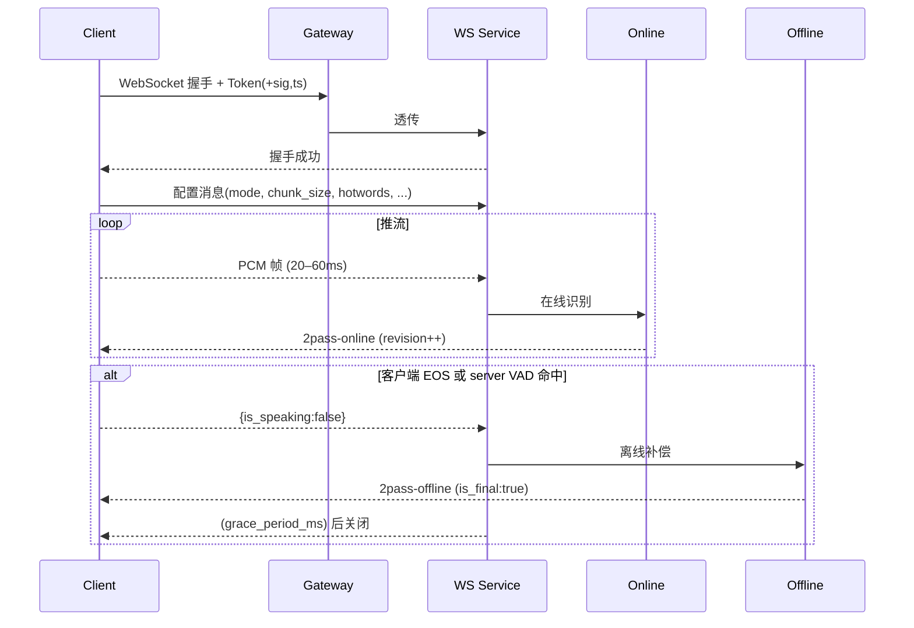

# 智能语音识别服务接口说明 v1.1（修订版）

> 本版为 **v1.1**。在不改变既有接口主体的前提下，明确了 **实时 2pass 纠错的消息契约**、**终态标记**、**触发逻辑**、**帧/时序/超时约束**、**热词格式** 与 **错误码映射**，并补充了 **Demo 用例** 与 **回调签名**。旨在降低第三方接入歧义与踩坑成本。

---

## 变更要点（相对 v1.0）
- 修正：离线最终结果 `is_final` 明确定义为 **true**。
- 新增：统一的“**消息协议契约**”（`revision` / `patch` / `t_audio_ms` / `sentences` / `engine_version`）。
- 新增：**端点触发与 VAD 互补**策略（`client_eos` 优先；`vad_silence_ms` 兜底）。
- 新增：**帧尺寸与频率**、**静默超时**、**最大会话时长**、**心跳**的默认约束与可调参数。
- 新增：**热词（hotwords）格式与权重**，支持会话内热更新与 TTL。
- 新增：**时间戳语义**（`t_audio_ms` 相对偏移 + 句级 `sentences`）。
- 新增：**错误码映射**（HTTP ↔ WebSocket 关闭码 ↔ 业务子码）。
- 新增：**REST 回调签名** 与 **幂等语义**（Idempotency-Key）。
- 新增：Demo 场景：在线→离线替换、端点两种触发、热词热更新、异常恢复、采样率兼容、多段会话复用。

---

## 1. 概述
服务提供两类接口：
- **REST 离线识别**：整段音频批量转写，适合异步/批处理。
- **WebSocket 实时识别**：面向实时字幕/会议记录/通话转写，支持 **2pass（在线 + 离线补偿）**。

统一域名与版本：`https://<your-domain>/v1`、`wss://<your-domain>/v1`。

---

## 2. 鉴权与安全
- **令牌**：Bearer Token（建议 JWT 或与网关共享的短期访问令牌）。
- **携带方式**：
  - REST：`Authorization: Bearer <token>`
  - WS：优先透传 `Authorization`；若受限，可用查询串 `?token=`（配合签名/时效）。
- **可选防重放签名（WS/回调）**：
  - 发送：`ts=<unix秒>`，`sig=BASE64(HMAC_SHA256(token|ts, secret))`，校验过期（如 60s）。
- **入口限流与审计**：建议在 API 网关实现 QPS/并发/来源 IP 限制与审计日志。

---

## 3. REST 离线识别接口

### 3.1 Endpoint
| 方法 | 路径 | 说明 |
|---|---|---|
| POST | `/v1/transcribe/offline/jobs` | 创建离线识别任务 |
| GET  | `/v1/transcribe/offline/jobs/{job_id}` | 查询任务状态与结果 |
| POST | `/v1/transcribe/offline/jobs/{job_id}/cancel`（可选） | 取消任务 |

> 若服务内部仍沿用旧路径，可通过网关映射至上述外部路径。

### 3.2 创建任务
**Headers**
- `Authorization: Bearer <token>`（必填）
- `Content-Type: multipart/form-data`
- `Idempotency-Key`（建议）：同 key + 同 body，60 分钟内返回同一 `job_id`

**Body（multipart）**
- `audio`（必填）：音频文件（`wav/mp3/m4a/aac/flac` 等），建议 ≤ 50MB
- `language`（可选，默认 `zh-CN`）：`zh-CN|en-US|...`
- `itn`（可选，默认 `true`）：数值/日期等规范化
- `hotwords`（可选）：见 §5.6
- `extra`（可选）：透传元数据（JSON）

**响应**
```json
{ "job_id": "off-20250121-0001", "status": "queued", "engine_version": "funasr-2.0.1" }
```

### 3.3 查询任务
**响应示例**
```json
{
  "job_id": "off-20250121-0001",
  "status": "succeeded",
  "result": {
    "text": "各位同事，大家好。……",
    "sentences": [
      {"text":"各位同事，大家好。","start_ms":0,"end_ms":2100}
    ],
    "language": "zh-CN",
    "engine_version": "funasr-2.0.1",
    "meta": {"audio_duration_ms": 183000}
  }
}
```

### 3.4 回调（可选）
- **Header**：`X-Timestamp: <unix秒>`，`X-Signature: sha256=<base64(HMAC_SHA256(body, secret))>`
- **重试**：建议 5 次指数退避；消费方以 `Idempotency-Key` 去重

---

## 4. WebSocket 实时识别

### 4.1 握手
- URL：`wss://<your-domain>/v1/transcribe/ws[?token=...]`
- 子协议：`binary`（二进制音频帧 + JSON 控制消息）
- 连接成功后，**客户端先发送配置消息**（见 4.2），然后开始推送音频帧

### 4.2 配置消息（JSON）
```json
{
  "mode": "2pass|online|offline",
  "audio_fs": 16000,
  "wav_name": "mic_session",
  "chunk_size": [5, 10, 5],      // 与示例一致：前/中/后窗口，毫秒
  "chunk_interval": 10,          // 推送间隔，毫秒
  "language": "zh-CN",
  "itn": true,
  "hotwords": {                  // 见 §4.7
    "terms": [{"text":"中交集团","boost":6.0}],
    "ttl_ms": 600000
  },
  "vad_silence_ms": 800,         // 0=关闭服务端 VAD，仅靠客户端 EOS
  "grace_period_ms": 200         // 发送最终结果后，服务端延迟关断
}
```
> 若后续需在会话内更新参数（如 `hotwords`、`chunk_size`），可再次发送配置消息进行 **热更新**。

### 4.3 音频帧（Binary）
- 格式：**PCM Little Endian，16-bit，Mono**
- 采样率：与 `audio_fs` 一致（默认 16k）。若不一致：
  - **容忍策略**：可选（服务端自动重采样 8k/16k/32k/48k）
  - **严格策略**：返回关闭码 4400 和 `{"code":440002,"message":"unsupported sample_rate"}`
- 分片与频率：
  - **每帧 20–60 ms**（推荐 40 ms ≈ 1280 samples ≈ 2560 bytes）
  - **消息频率 ≤ 50 msg/s**，**单帧 ≤ 16 KB**

### 4.4 控制消息（JSON）
- `{"is_speaking": false}`：客户端显式 **EOS**，触发离线补偿（优先级最高）
- 运行期热更新：`hotwords` / `chunk_size` / `language` / `itn` 等
- 心跳：浏览器无原生 ping 时，可发送 `{ "ping": 1 }`（≤ 1/20s）

### 4.5 端点触发与关闭
- **触发进入离线补偿**：满足以下任一条件
  1) 客户端发送 `is_speaking=false`（**client_eos**）
  2) 连续静默超过 `vad_silence_ms`（**server_vad**），默认 800ms
- **最终结果与关断**：服务端发送一次 `is_final: true` 的 `2pass-offline` 消息后，进入 `grace_period_ms`（默认 200ms）并可关闭连接；客户端亦可主动 `close`

### 4.6 **消息协议契约**（统一返回结构）
```json
{
  "mode": "2pass-online | 2pass-offline | online | offline",
  "revision": 7,
  "wav_name": "meeting_20250121",
  "text": "各位同事大家好",            // 始终给出全量文本，便于低成本接入
  "patch": {                          // 可选：差量，供高阶前端精准替换
    "replace": [ { "range": [0, 6], "text": "各位同事，大家好" } ]
  },
  "t_audio_ms": 3520,                 // 当前片段对应的音频相对时间（ms）
  "sentences": [                      // 离线阶段补充句级时间戳
    {"text":"各位同事，大家好。","start_ms":0,"end_ms":2100}
  ],
  "is_final": false,                  // **离线最终结果为 true**
  "language": "zh-CN",
  "engine_version": "funasr-2.0.1",
  "meta": {"unstable_rate": 0.12}
}
```
- **`revision`**：递增版本号；前端以最大 `revision` 为准做去并发/去乱序
- **差量策略**：若返回 `patch`，同帧也应同时给 `text`（全量）以便简化接入

**在线示例**
```json
{"mode":"2pass-online","revision":5,"text":"各位同事大家","t_audio_ms":1680,"is_final":false}
```
**离线最终示例**
```json
{"mode":"2pass-offline","revision":12,"text":"各位同事，大家好。","sentences":[{"text":"各位同事，大家好。","start_ms":0,"end_ms":2100}],"is_final":true}
```

### 4.7 热词（会话内可热更新）
```json
"hotwords": {
  "terms": [
    {"text": "中交集团", "boost": 6.0},
    {"text": "应急处置", "boost": 4.0}
  ],
  "ttl_ms": 600000,
  "strategy": "replace"   // replace=整包覆盖（默认）|merge=增量合并
}
```

### 4.8 超时、心跳与会话时长
- `idle_audio_timeout_ms = 5000`：超过该时间未收到音频/控制消息 ⇒ 关闭（4400）
- `max_session_ms = 300000`（5 分钟）：达到上限 ⇒ 关闭（4400），返回最后已完成结果
- WebSocket `ping/pong`：建议 20–30s，一致化网关空闲回收策略

### 4.9 错误码与映射
| 场景 | HTTP | WS Close | 业务子码 | 说明 |
|---|---:|---:|---:|---|
| 参数/帧错误 | 400 | 4400 | 440001/440002 | JSON 解析失败 / 采样率不支持 |
| 鉴权失败 | 401 | 4401 | 40101 | Token 无效/过期 |
| 限流/并发 | 429 | 4290 | 42901 | 超出配额/并发上限 |
| 服务器异常 | 500 | 4500 | 50001 | 内部错误，建议退避重试 |

统一错误体（REST/WS 消息内）
```json
{"code": 440001, "message": "invalid frame", "request_id": "..."}
```

### 4.10 时序示意（Mermaid）


---

## 5. Demo 指南（可直接抄用）

### 5.1 在线→离线替换（revision/patch）
- 演示 3 条 online + 1 条 offline，前端以 `revision` 做幂等更新；
- 提供两种消费方式：**全量覆盖**与**差量 patch** 应用。

### 5.2 端点两种触发
- A) 显式发送 `{"is_speaking":false}`；B) 不发送，靠 `vad_silence_ms` 自动收敛；
- 比较两者延迟与误触发差异。

### 5.3 热词热更新
- 会话中途更新 `hotwords`，观察术语识别显著变化。

### 5.4 异常恢复
- 模拟 4400（非法帧）与 4500（内部错）两条路径；客户端**指数退避**并**重建会话**。

### 5.5 采样率不匹配
- 展示 48k → 16k 的客户端重采样与服务端容忍两种策略。

### 5.6 多段会话复用
- 在同一连接内模拟多段语音：`true/false/true/false`，验证每段 `revision` 独立递增与 `sentences` 正确归属。

> 建议将 Demo 封装为 `Session` 类：`connect()`、`sendAudio()`、`updateHotwords()`、`stop()`、`finalize()`，并统一日志与指标上报。

---

## 6. 限流与并发（建议值）
- `max_conns_per_token`: 10
- `max_qps_per_conn`: 50
- 超限返回：REST=429（`42901`）；WS 关闭码 `4290`

---

## 7. 监控与日志
- 关键指标：ASR 延迟（online/offset/TTFT）、离线补偿耗时、字错率（CER/WER）、VAD 命中率、掉线率、限流命中率
- 关键日志：`request_id` 链路、鉴权结果、错误码、`revision` 序列、热词变更

---

## 8. 版本化与兼容
- 明确主版本 `/v1`；新增字段默认向后兼容且**可忽略**；
- 弃用字段提前一版标注 `@deprecated` 并保留至少 90 天

---

## 9. 附录 A：前端最小实现片段（浏览器）
```javascript
const TOKEN = '<token>';
const WS_URL = `wss://<your-domain>/v1/transcribe/ws?token=${encodeURIComponent(TOKEN)}`;
const TARGET_SR = 16000;
let ws, audioContext, processor;

function open() {
  ws = new WebSocket(WS_URL, 'binary');
  ws.binaryType = 'arraybuffer';
  ws.onopen = async () => {
    ws.send(JSON.stringify({
      mode: '2pass', audio_fs: TARGET_SR, wav_name: 'mic_session',
      chunk_size: [5,10,5], chunk_interval: 10, itn: true,
      vad_silence_ms: 800, grace_period_ms: 200
    }));
    const stream = await navigator.mediaDevices.getUserMedia({ audio: true });
    audioContext = new AudioContext({ sampleRate: TARGET_SR });
    const source = audioContext.createMediaStreamSource(stream);
    processor = audioContext.createScriptProcessor(4096, 1, 1);
    processor.onaudioprocess = (e) => {
      const f32 = e.inputBuffer.getChannelData(0);
      const pcm = floatTo16BitPCM(f32); // 已在 TARGET_SR 采集
      if (pcm && ws.readyState === WebSocket.OPEN) ws.send(pcm);
    };
    source.connect(processor); processor.connect(audioContext.destination);
  };
  ws.onmessage = (ev) => handleResult(JSON.parse(ev.data));
  ws.onclose = () => cleanup();
}

function handleResult(msg){
  if (msg.patch) applyPatch(msg.patch); else renderText(msg.text);
  if (msg.is_final) console.log('final:', msg.text);
}

function stop(){
  if (ws?.readyState === WebSocket.OPEN) ws.send(JSON.stringify({is_speaking:false}));
}

function cleanup(){ processor?.disconnect(); audioContext?.close(); }

function floatTo16BitPCM(f32){
  const out = new Int16Array(f32.length);
  for (let i=0;i<f32.length;i++){ const s=Math.max(-1,Math.min(1,f32[i])); out[i]=s<0?s*0x8000:s*0x7fff; }
  return out;
}
```

---

## 10. 附录 B：Patch 格式（建议）
```json
{"replace": [ { "range": [start, end], "text": "..." } ]}
```
- `range` 为**闭开区间** `[start, end)`，基于 **UTF-16 code unit** 索引
- 客户端可选用全量覆盖策略以简化实现

---

## 11. 附录 C：错误码清单（节选）
```json
{
  "40101": "invalid token",
  "42901": "rate limit exceeded",
  "440001": "invalid frame",
  "440002": "unsupported sample_rate",
  "50001": "internal error"
}
```

---

> **落地建议**：先以网关灰度放量（1%→10%→100%），期间收集 `revision` 抖动、离线补偿时延与 VAD 误检率，稳定后再开放给第三方。
