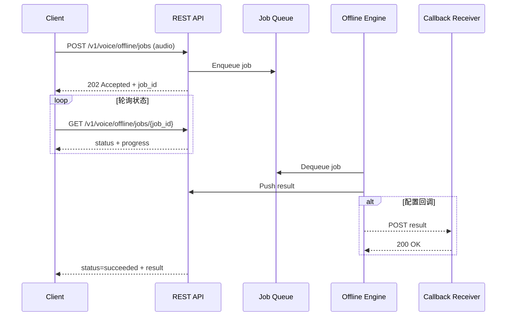
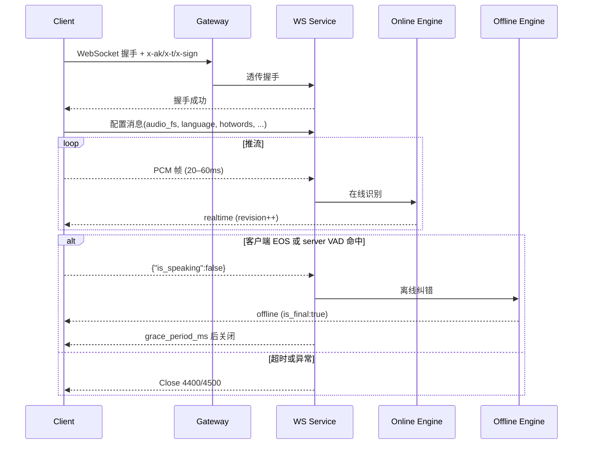
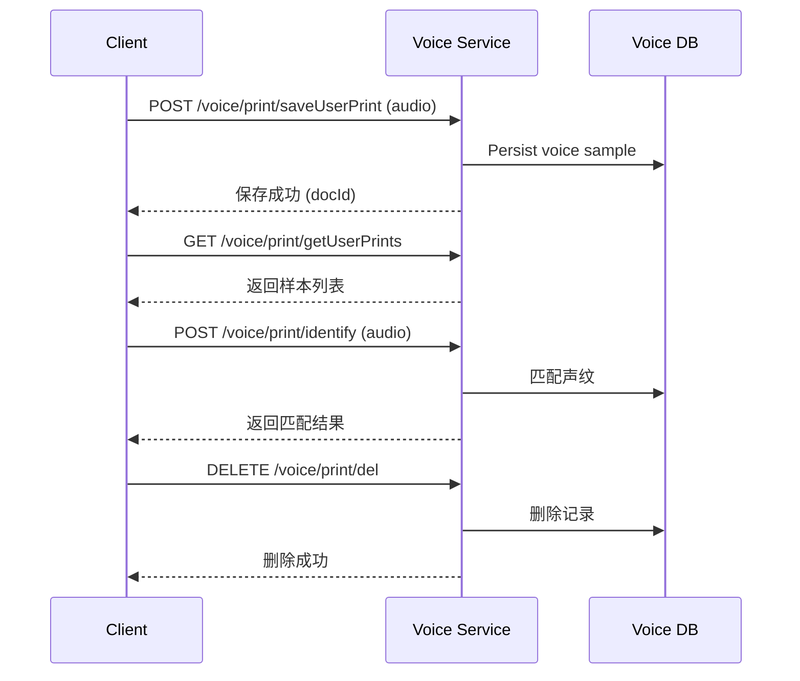

# 智能语音与声纹服务接口规范 v1

## 0. 全局规范

- **统一响应结构**：除 WebSocket 音频帧外，所有 REST 与 WS 业务消息均遵循  
  ```json
  {
    "code": 0,
    "message": "ok",
    "data": {}
  }
  ```
  `code=0` 表示成功，`code>0` 表示业务错误；HTTP 状态仅表达传输语义。
- **公共字段**：分页使用 `page`、`pageSize`、`total`、`items`；时间均为毫秒整数并以下划线 `_ms` 结尾，可在日志中并行输出 ISO8601。
- **错误体**：错误响应与成功结构一致，仅将 `code`、`message` 置为对应业务码和描述；必要时在 `data` 中补充错误上下文。

## 1. 概述

本规范统一描述语音识别（离线批量与实时流式）与声纹管理能力的开放接口，涵盖接入要求、请求/响应结构、示例以及错误码。除非特别说明，所有时间单位均为毫秒，布尔字段使用 `true/false` 表示。

- REST 离线识别：适用于整段音频文件的批量转写，可结合回调实现异步处理。
- WebSocket 实时识别：适用于实时字幕、会议记录等场景，采用实时识别 + 离线纠错的双路模式。
- 声纹管理接口：提供声纹注册、识别与管理能力。

## 2. 服务接入

### 2.1 域名与版本

- REST：`https://<your-domain>/v1`
- WebSocket：`wss://<your-domain>/v1`
- 主版本使用 `/v1` 前缀。

**环境说明**：
- 生产环境：`https://api.your-domain.com/v1`
- 测试环境：`https://test-api.your-domain.com/v1`
- 开发环境：`https://dev-api.your-domain.com/v1`

### 2.2 鉴权与安全

- 凭证：平台为每个租户颁发 `AppKey` 与 `AppSecret`，请妥善保管 `AppSecret`，避免在客户端代码或日志中明文暴露。
- 请求需在 Header 携带以下字段完成签名校验：
  - `x-ak`：AppKey。
  - `x-t`：当前毫秒时间戳（字符串），建议直接使用 `Date.now().toString()`。
  - `x-sign`：`MD5(AppKey + AppSecret + x-t)` 的 32 位小写十六进制串。
- 时间戳允许的最大误差为 ±300 秒，超出将返回签名过期错误；重放请求需重新计算时间戳与签名。
- 示例：
  ```bash
  timestamp=$(date +%s%3N)
  signature=$(echo -n "${APP_KEY}${APP_SECRET}${timestamp}" | md5sum | cut -d' ' -f1)
  curl https://api.your-domain.com/v1/ping \
    -H "x-ak: ${APP_KEY}" \
    -H "x-t: ${timestamp}" \
    -H "x-sign: ${signature}"
  ```
- WebSocket 握手无法自定义 Header，须将 `x-ak`、`x-t`、`x-sign` 以查询参数形式附加至 URL（例如 `?x-ak=...&x-t=...&x-sign=...`）。
- 所有接口仅在 HTTPS/WSS 通道开放，建议在网关层启用 IP 白名单、QPS/并发限流和审计日志。

### 2.3 凭证申请与管理

- 运维/平台管理员为租户创建独立的 `AppKey` 与 `AppSecret`，并配置可访问的接口范围及限流策略。
- `AppSecret` 仅在创建时下发一次，请立即存入受控配置中心或密钥管理服务，避免写入客户端或浏览器代码。
- 建议按业务系统或环境划分多组凭证，便于追踪与隔离；若凭证疑似泄漏，应第一时间在管理端吊销并重新生成。
- 为降低长期凭证风险，可结合运维流程定期轮换 `AppSecret`，并通知调用方在新旧凭证的可重叠窗口内完成切换。

### 2.4 接口通用说明

- **编码**：除文件上传外，默认使用 `application/json` 与 UTF-8 编码。
- **时间字段**：统一使用毫秒整数（字段以 `_ms` 结尾），必要时可在日志或回调中额外提供 ISO8601 字符串。
- **分页约定**：`page` 从 1 开始计数，`pageSize` 默认 10，建议控制在 10～100；响应携带 `total` 便于前端分页。
- **响应结构**：遵循统一格式，业务负载全部置于 `data` 字段；错误同样遵循该结构，仅调整 `code` 与 `message`。
- **安全要求**：所有接口需在 HTTPS/WSS 通道下访问，并实现 IP 白名单、速率限制与审计日志。

### 2.5 最佳实践

**错误处理**：
```javascript
try {
  const timestamp = Date.now().toString();
  const sign = md5(appKey + appSecret + timestamp); // md5 函数可来自 crypto-js 等库
  const response = await fetch('/v1/voice/offline/jobs', {
    method: 'POST',
    headers: {
      'x-ak': appKey,
      'x-t': timestamp,
      'x-sign': sign,
    },
    body: formData
  });
  
  const result = await response.json();
  if (result.code !== 0) {
    console.error('业务错误:', result.message);
    // 处理业务错误
  }
} catch (error) {
  console.error('网络错误:', error);
  // 处理网络错误
}
```

**重试机制**：
- 网络错误：指数退避重试，最多 3 次
- 限流错误（429）：等待 1-5 秒后重试
- 服务器错误（5xx）：等待 2-10 秒后重试

## 3. REST 离线识别

### 3.1 Endpoint

| 方法   | 路径                                                | 说明          |
| ---- | ------------------------------------------------- | ----------- |
| POST | `/v1/voice/offline/jobs`                     | 创建离线识别任务    |
| GET  | `/v1/voice/offline/jobs/{job_id}`            | 查询任务状态与结果   |

> 若内部仍使用旧路径，可由网关映射至上述外部路径。

### 3.2 创建任务（POST `/v1/voice/offline/jobs`）

**Headers**

| 字段 | 类型 | 必填 | 说明 |
| --- | --- | --- | --- |
| `x-ak` | string | 是 | AppKey，用于标识调用方 |
| `x-t` | string | 是 | 当前毫秒时间戳，字符串形式 |
| `x-sign` | string | 是 | `MD5(AppKey + AppSecret + x-t)` 结果，32 位小写 |
| `Content-Type` | string | 是 | 固定为 `multipart/form-data` |

**Body（multipart）**

| 字段 | 类型 | 必填 | 默认值 | 说明 |
| --- | --- | --- | --- | --- |
| `audio` | file | 是 | - | 音频文件二进制体，支持 `wav/mp3/m4a/aac/flac`，采样率 ≥ 8 kHz，推荐大小 ≤ 50 MB |
| `language` | string | 否 | `zh-CN` | 识别语言标识 |
| `itn` | boolean | 否 | `true` | 是否启用数值、日期等智能文本规范化 |
| `hotwords` | string(JSON) | 否 | - | 热词配置 JSON 字符串，结构见 §6.4 |
| `extra` | string(JSON) | 否 | - | 透传业务自定义元数据，服务端原样存储，可用于对账 |

**流程说明**

1. 服务校验签名、时间戳、文件大小与格式，若不符合要求返回 4xx。
2. 通过对象存储或临时目录安全保存音频文件，并记录上下文元数据。
3. 将任务指针写入消息队列，后台工作节点异步消费。
4. 同步响应中返回任务 ID 与当前状态，便于后续查询或对账。

**响应示例**（HTTP 202）

```json
{
  "code": 0,
  "message": "accepted",
  "data": {
    "job_id": "off-20250121-0001",
    "status": "queued"
  }
}
```

**响应字段说明（data）**

| 字段 | 类型 | 说明 |
| --- | --- | --- |
| `job_id` | string | 离线识别任务唯一 ID |
| `status` | string | 当前任务状态，取值见 §3.3 |

### 3.3 查询任务（GET `/v1/voice/offline/jobs/{job_id}`）

**Path 参数**

| 参数 | 类型 | 必填 | 说明 |
| --- | --- | --- | --- |
| `job_id` | string | 是 | 创建任务时返回的唯一 ID |

**Headers**

| 字段 | 类型 | 必填 | 说明 |
| --- | --- | --- | --- |
| `x-ak` | string | 是 | AppKey，用于标识调用方 |
| `x-t` | string | 是 | 当前毫秒时间戳，字符串形式 |
| `x-sign` | string | 是 | `MD5(AppKey + AppSecret + x-t)` 结果，32 位小写 |

**响应示例**

```json
{
  "code": 0,
  "message": "ok",
  "data": {
    "job_id": "off-20250121-0001",
    "status": "succeeded",
    "progress": 1.0,
    "submitted_at_ms": 1737448878000,
    "completed_at_ms": 1737448924000,
    "result": {
      "text": "各位同事，大家好。……",
      "sentences": [
        {"text": "各位同事，大家好。", "start_ms": 0, "end_ms": 2100}
      ],
      "language": "zh-CN",
      "meta": {
        "audio_duration_ms": 183000,
        "unstable_rate": 0.08,
        "submitted_at_iso": "2025-01-21T06:01:18Z",
        "completed_at_iso": "2025-01-21T06:02:04Z"
      }
    }
  }
}
```

**字段说明（data）**

| 字段 | 类型 | 说明 |
| --- | --- | --- |
| `job_id` | string | 任务唯一 ID |
| `status` | string | 当前状态，取值见下文 |
| `progress` | number | 0～1 的进度值；若后台不支持可固定为 `null` |
| `submitted_at_ms` | int64 | 任务提交时间（毫秒） |
| `completed_at_ms` | int64 | 任务完成时间（毫秒），未完成时缺省 |
| `result` | object | 成功后返回的识别结果对象 |
| `error` | object | 可选错误上下文，失败时可携带内部码等信息 |

**字段说明（data.result）**

| 字段 | 类型 | 说明 |
| --- | --- | --- |
| `text` | string | 完整转写文本 |
| `sentences` | array<object> | 句级时间戳列表，默认开启；可在创建任务时关闭 |
| `language` | string | 识别语言标识 |
| `meta` | object | 可选扩展信息，例如音频时长、置信度等 |

`sentences` 元素结构：

| 字段 | 类型 | 说明 |
| --- | --- | --- |
| `text` | string | 句子文本 |
| `start_ms` | int64 | 句子开始时间（毫秒） |
| `end_ms` | int64 | 句子结束时间（毫秒） |

状态取值：`queued`、`processing`、`succeeded`、`failed`。失败时顶层 `code > 0`，`message` 携带错误描述，可在 `data.error` 中补齐内部子码或排查信息（例如 `{"code":50001,"message":"internal error"}`）。


### 3.4 回调（可选）

- Header：`Content-Type: application/json`；如部署侧需要鉴权，可额外配置回调专用 Token。
- Body：与查询任务时 `data.result` 结构一致，并补充顶层 `code`、`message` 字段。
- 回调方需在 5 次以内（指数退避）完整消费通知，可使用 `job_id` 去重，并返回 `2xx`。

### 3.5 REST 错误码

| HTTP | code  | message              | 说明             |
| ---- | ----- | -------------------- | -------------- |
| 400  | 40001 | invalid audio format | 不支持的音频编码或采样率异常 |
| 401  | 40101 | invalid signature    | 签名缺失、过期或校验失败   |
| 413  | 41301 | payload too large    | 音频文件超过限制       |
| 429  | 42901 | rate limit exceeded  | 排队溢出或触发限流      |
| 500  | 50001 | internal error       | 服务内部错误         |
| 504  | 50401 | job timeout          | 处理超时           |

### 3.6 离线任务时序



## 4. WebSocket 实时识别

### 4.1 握手

- URL：`wss://<your-domain>/v1/voice/realtime[?x-ak=...&x-t=...&x-sign=...]`
- 子协议：`binary`
- 流程：连接建立 → 客户端发送配置消息 → 推送音频帧 → 等待离线纠错。

### 4.2 配置消息（JSON）

**发送时机**

- WebSocket 握手成功后，客户端必须先发送一条配置消息，服务端在收到合法配置前不会消费音频帧。
- 会话进入 `FINAL` 状态后，如需重新识别下一段语音，可在同一连接内先发送新的配置消息，再开始推送音频。
- 运行中可以再次发送配置消息以热更新 `language`、`hotwords` 等，新的配置自下一帧音频起生效。

```json
{
  "audio_fs": 16000,
  "wav_name": "mic_session",
  "language": "zh-CN",
  "itn": true,
  "hotwords": {
    "terms": [{"text":"心肌梗死","boost":6.0}],
    "ttl_ms": 600000
  },
  "vad_silence_ms": 800,
  "grace_period_ms": 200
}
```

> 会话内可再次发送配置消息进行热更新（如修改 `hotwords`、`language` 等）。

**字段说明**

| 字段 | 类型 | 必填 | 默认值 | 说明 |
| --- | --- | --- | --- | --- |
| `audio_fs` | int32 | 否 | 16000 | 音频采样率，支持 8000/16000 Hz，需与音频帧保持一致 |
| `wav_name` | string | 否 | - | 会话标识，便于检索与日志追踪 |
| `language` | string | 否 | `zh-CN` | 识别语言，支持 `zh-CN`、`en-US` 等 |
| `itn` | boolean | 否 | `true` | 是否启用智能文本规范化 |
| `hotwords` | object | 否 | - | 热词设置，结构见 §4.9 |
| `vad_silence_ms` | int32 | 否 | 800 | 服务端 VAD 静默阈值，单位毫秒 |
| `grace_period_ms` | int32 | 否 | 200 | 离线最终结果后延迟关闭的缓冲时间，单位毫秒 |

### 4.3 识别模式说明

系统采用**实时识别 + 离线纠错**的双路模式，自动提供最佳识别效果：

- **实时识别**：200ms 内返回增量识别结果，支持实时字幕显示
- **离线纠错**：语音结束后 1-2 秒内提供高精度纠错结果和时间戳
- **自动切换**：系统根据语音状态自动切换识别模式，无需客户端干预

**服务端返回模式标识**：
- `realtime`：实时识别结果
- `offline`：离线纠错结果（最终结果）

### 4.4 会话状态机

状态流转：`INIT → STREAMING → EOS → OFFLINE_COMP → FINAL → (RESTART | CLOSE)`

- `INIT`：握手成功，仅允许发送配置消息；服务端校验后进入 `STREAMING`。
- `STREAMING`：持续推流阶段，服务端返回 `mode=realtime` 的增量结果，并递增 `revision`。
- `EOS`：客户端发送 `{"is_speaking": false}` 或命中服务端 VAD 止语进入该状态。
- `OFFLINE_COMP`：离线纠错计算中，服务端返回 `mode=offline` 结果，并在最终帧携带 `is_final=true`。
- `FINAL`：会话完成，可在 `grace_period_ms` 内等待客户端处理；如需继续会话，发送新的配置进入 `RESTART`，否则关闭。

**状态与动作对照**

| 状态 | 客户端应执行的操作 | 服务端行为 |
| --- | --- | --- |
| `INIT` | 发送配置消息并等待服务端返回首条业务消息；如收到错误需重新配置或断开 | 校验配置，准备接收音频 |
| `STREAMING` | 按配置推送 PCM 帧；根据返回的 `revision` 去重展示 | 持续返回 `mode=realtime` 的增量结果 |
| `EOS` | 停止发送音频，确保一次性发送 `{"is_speaking":false}` 控制消息 | 启动离线纠错流程 |
| `OFFLINE_COMP` | 等待最终结果；无需重复 EOS | 返回 `mode=offline` 结果，最后一帧带 `is_final=true` |
| `FINAL` | 根据需要：发送新配置进入下一段，或主动关闭连接 | 在 `grace_period_ms` 后可主动关闭会话 |

约束与错误：

- `OFFLINE_COMP` 未完成前再次推流或重复 EOS，会返回 `{"code": 440003, "message": "session busy"}` 并在必要时断开连接。
- 客户端需以最大 `revision` 去重乱序；当收到 `patch` 字段时，优先使用同帧 `text` 作为基线再应用差量。

### 4.5 音频帧（Binary）

- PCM Little Endian，16-bit 单声道。
- 采样率需与 `audio_fs` 一致；严格模式下不一致将返回关闭码 4400 与 `{"code":440002,"message":"unsupported sample_rate"}`。
- 帧长度建议 40 ms（约 1280 samples ≈ 2560 bytes），消息频率 ≤ 50 条/秒，单帧 ≤ 16 KB。
- 对于浏览器端的分片，可通过 AudioWorklet/ScriptProcessor 进行缓冲并对齐推送。

### 4.6 控制消息（JSON）

- `{"is_speaking": false}`：显式 EOS，触发离线纠错，优先级最高。
- 热更新：配置同 4.2，可动态调整 `hotwords`、`language`、`itn` 等。
- 心跳：可发送 `{"ping": 1}`（≤ 1/20s），防止长时间静默被判定超时。

**控制消息字段说明**

| 字段 | 类型 | 说明 |
| --- | --- | --- |
| `is_speaking` | boolean | `false` 表示语音结束；`true` 可用于恢复推流，默认不必显式发送 |
| `ping` | int32 | 心跳标记，取值恒为 1，服务端仅用于检测连接活跃 |

### 4.7 端点触发与关闭

- 触发离线纠错条件：
  1. 客户端发送 `is_speaking=false`（client EOS）。
  2. 连续静默超过 `vad_silence_ms`（默认 800ms），服务器自动止语。
- 服务端发送 `is_final: true` 的 `offline` 消息后进入 `grace_period_ms`（默认 200ms），随后可关闭连接；客户端亦可主动 `close`。
- 若需在同一连接内处理多段语音，可在离线结果返回后重新发送配置消息并继续推流。

### 4.8 消息协议契约

```json
{
  "mode": "realtime | offline",
  "revision": 7,
  "wav_name": "meeting_20250121",
  "text": "各位同事大家好",
  "patch": {
    "replace": [ { "range": [0, 6], "text": "各位同事，大家好" } ]
  },
  "t_audio_ms": 3520,
  "sentences": [
    {"text":"各位同事，大家好。","start_ms":0,"end_ms":2100}
  ],
  "is_final": false,
  "language": "zh-CN",
  "meta": {"unstable_rate": 0.12}
}
```

**字段说明**

| 字段 | 类型 | 说明 |
| --- | --- | --- |
| `mode` | string | 结果类型：`realtime` 为实时增量，`offline` 为离线纠错 |
| `revision` | int64 | 递增版本号，客户端按最大值去重、处理乱序 |
| `wav_name` | string | 会话标识，回显配置中的 `wav_name`，便于关联 |
| `text` | string | 当前识别文本，全量覆盖 |
| `patch` | object | 可选增量信息，当存在时需结合 `text` 一起使用 |
| `t_audio_ms` | int64 | 已处理的音频时长，单位毫秒 |
| `sentences` | array<object> | 句级时间戳，仅离线结果阶段返回 |
| `is_final` | boolean | 离线最终结果时为 `true`，其他阶段 `false` |
| `language` | string | 识别语言，通常与配置一致 |
| `meta` | object | 可选扩展指标，如置信度、实时稳定度等 |

`patch` 结构：

| 字段 | 类型 | 说明 |
| --- | --- | --- |
| `replace` | array<object> | 替换列表，`range` 表示字符区间，`text` 为替换文本 |

`replace` 元素字段说明：

| 字段 | 类型 | 说明 |
| --- | --- | --- |
| `range` | array<int32> | `[start, end)` 形式的字符区间，基于当前 `text` 计算 |
| `text` | string | 替换后的文本片段 |

`sentences` 元素结构同 §3.3。

**实时识别示例**

```json
{"mode":"realtime","revision":5,"text":"各位同事大家","t_audio_ms":1680,"is_final":false}
```

**离线纠错最终示例**

```json
{"mode":"offline","revision":12,"text":"各位同事，大家好。","sentences":[{"text":"各位同事，大家好。","start_ms":0,"end_ms":2100}],"is_final":true}
```

### 4.9 热词配置

```json
"hotwords":{
  "terms": [
    {"text": "心肌梗死", "boost": 6.0},
    {"text": "冠状动脉", "boost": 4.0}
  ],
  "ttl_ms": 600000,
  "strategy": "replace"
}
```

- `strategy`: `replace`（整包覆盖）或 `merge`（增量合并）。
- `ttl_ms`: 有效期，过期后恢复默认模型热词；未提供时热词持久有效。
- 会话内热更新需附带完整热词列表，以避免语义不一致。

### 4.10 超时、心跳与会话时长

- `idle_audio_timeout_ms = 5000`：超过该时间未收到音频/控制消息 → 关闭（4400）。
- `max_session_ms = 300000`（5 分钟）：达到上限 → 关闭（4400），返回最后已完成结果。
- 客户端应实现 WebSocket `ping/pong`（20–30s），并处理服务器关闭后的重连流程。

### 4.11 背压与节流

- 当服务端识别队列积压达到阈值时，会发送业务消息：
  ```json
  {"code": 42901, "message": "rate limit exceeded", "data": {"suggest_fps": 25}}
  ```
  客户端需根据 `suggest_fps` 调整推流频率或暂停发送。
- 队列持续超限（默认 2～3 秒）时，服务端可直接关闭连接（WS Close `4290`），客户端应退避重连并上报。

### 4.12 错误码映射

| 场景     | HTTP | WS Close | 业务子码          | 说明                 |
| ------ | ---- | -------- | ------------- | ------------------ |
| 参数/帧错误 | 400  | 4400     | 440001/440002 | JSON 解析失败 / 采样率不支持 |
| 会话冲突   | 409  | 4400     | 440003        | 会话仍在补偿阶段，拒绝新的音频或重复 EOS |
| 鉴权失败   | 401  | 4401     | 40101         | Token 无效或过期        |
| 限流/并发  | 429  | 4290     | 42901         | 超出配额或并发上限          |
| 服务器异常  | 500  | 4500     | 50001         | 内部错误，需重试           |

**统一错误体**

```json
{"code": 440001, "message": "invalid frame"}
```

### 4.13 实时识别时序



## 5. 声纹管理 API

### 5.1 公共说明

- 基础路径：`/voice/print`
- 认证：同 2.2，所有请求需携带 `x-ak`、`x-t`、`x-sign`。
- 数据格式：默认 `application/json`；上传音频使用 `multipart/form-data` 或 `application/x-www-form-urlencoded` 中的文件字段。
- 业务约束：声纹样本需满足最短 1 秒、最长 30 秒的音频长度，采样率不少于 16 kHz 单声道。
- 常见错误码：
  
  | code  | message              | 说明           |
  | ----- | -------------------- | ------------ |
  | 40101 | invalid signature    | 签名缺失、过期或校验失败 |
  | 40011 | invalid voice sample | 音频时长/格式不符合要求 |
  | 40401 | user not found       | 指定的用户不存在     |
  | 40901 | voiceprint conflict  | 声纹重复或冲突      |
  | 50002 | voice service error  | 声纹引擎执行失败     |

### 5.2 使用流程概览



### 5.3 删除用户声纹（DELETE `/voice/print/del`）

**请求体（application/json）**

```json
{
  "docId": "string",
  "userId": 10001
}
```

**Headers**

- `x-ak`: AppKey
- `x-t`: 当前毫秒时间戳字符串
- `x-sign`: `MD5(AppKey + AppSecret + x-t)`

**字段说明**

- `docId`：声纹样本文档 ID，用于定位待删除的音频。
- `userId`：业务系统内的用户 ID，需与声纹所属用户一致。

**业务说明**

- 删除操作需具备声纹管理权限。
- 若指定 `docId` 不存在或不属于该用户，接口返回 `40401`。
- 删除成功不返回数据，客户端可通过查询接口验证。

**响应体**

```json
{
  "code": 0,
  "message": "ok",
  "data": {}
}
```

### 5.4 获取用户列表（GET `/voice/print/getUserList`）

**用途**：提供具备声纹注册权限的业务用户列表，便于选择目标用户进行声纹录入。

**查询参数**

| 参数 | 说明 | 必填 | 类型 | 默认 |
|---|---|---|---|---|
| `page` | 页码 | 否 | int64 | 1 |
| `pageSize` | 页大小 | 否 | int64 | 10 |
| `name` | 用户名模糊搜索 | 否 | string | - |

**Headers**

- `x-ak`: AppKey
- `x-t`: 当前毫秒时间戳字符串
- `x-sign`: `MD5(AppKey + AppSecret + x-t)`

**响应体**

```json
{
  "code": 0,
  "message": "ok",
  "data": {
    "items": [
      {
        "id": 0,
        "name": "",
        "username": "",
        "mobile": "",
        "status": 0,
        "company": "",
        "create_time_ms": 0,
        "update_time_ms": 0
      }
    ],
    "page": 1,
    "pageSize": 10,
    "total": 0
  }
}
```

- 响应字段可根据业务需要补充，例如 `roles`、`lastLoginTime`，敏感信息应按合规要求脱敏。

### 5.5 获取用户声纹列表（GET `/voice/print/getUserPrints`）

**用途**：查询指定用户已注册的声纹样本，查看样本状态与文本内容。

**查询参数**

| 参数 | 说明 | 必填 | 类型 | 默认 |
|---|---|---|---|---|
| `userId` | 用户 ID | 是 | int64 | - |
| `page` | 页码 | 否 | int64 | 1 |
| `pageSize` | 页大小 | 否 | int64 | 10 |

**Headers**

- `x-ak`: AppKey
- `x-t`: 当前毫秒时间戳字符串
- `x-sign`: `MD5(AppKey + AppSecret + x-t)`

**响应体**

```json
{
  "code": 0,
  "message": "ok",
  "data": {
    "items": [
      {
        "id": "",
        "user_id": 0,
        "username": "",
        "txt": "",
        "wav_path": "",
        "create_time_ms": 0
      }
    ],
    "page": 1,
    "pageSize": 10,
    "total": 0
  }
}
```

- `wav_path`：相对路径，客户端需拼接接口域名与用户 ID 获取下载地址。
- `txt`：声纹采集时的文本提示，可用于质检或再训练场景。
- 可扩展 `status` 字段表示审核状态（例如 `pending`、`approved`、`rejected`）。

### 5.6 声纹鉴定（POST `/voice/print/identify`）

**用途**：上传音频进行声纹比对，返回匹配的用户信息及文本内容。

**表单字段（application/x-www-form-urlencoded 或 multipart）**

| 字段 | 说明 | 必填 | 类型 |
|---|---|---|---|
| `audio` | 待鉴定音频文件 | 是 | file |

**Headers**

- `x-ak`: AppKey
- `x-t`: 当前毫秒时间戳字符串
- `x-sign`: `MD5(AppKey + AppSecret + x-t)`
- `Content-Type: multipart/form-data`

**响应体**

```json
{
  "code": 0,
  "message": "ok",
  "data": {
    "txt": "",
    "user": {
      "id": 0,
      "name": "",
      "mobile": ""
    },
    "score": 0.92,
    "threshold": 0.85
  }
}
```

- `score`：匹配得分（0–1）用于判断相似度。
- `threshold`：系统当前命中的阈值，可根据业务级别调整。
- 若未匹配到用户，返回 `code=40401`、`message="user not found"`，`data` 为 `null`。

### 5.7 保存用户声纹（POST `/voice/print/saveUserPrint`）

**用途**：为指定用户创建或追加声纹样本。

**表单字段**

| 字段 | 说明 | 必填 | 类型 |
|---|---|---|---|
| `userId` | 用户 ID | 是 | int |
| `userName` | 用户姓名 | 是 | string |
| `audio` | 声纹样本音频 | 是 | file |

**Headers**

- `x-ak`: AppKey
- `x-t`: 当前毫秒时间戳字符串
- `x-sign`: `MD5(AppKey + AppSecret + x-t)`
- `Content-Type: multipart/form-data`

**响应体** 同 5.3。

- 音频需满足采样率、时长约束，不符合要求时返回 `code=40011`。
- 存储前可对音频进行归一化处理（采样率、时长），并记录 `docId` 以便后续删除或更新。
- 重复上传同一用户声纹时，需按业务规则指定覆盖或追加策略，冲突时返回 `40901`。

### 5.8 声纹接口错误码

| 场景    | HTTP | code  | message              | 说明               |
| ----- | ---- | ----- | -------------------- | ---------------- |
| 鉴权失败  | 401  | 40101 | invalid signature    | 签名缺失、过期或不合法      |
| 样本不合法 | 400  | 40011 | invalid voice sample | 音频编码、时长或信噪比不符合要求 |
| 用户不存在 | 404  | 40401 | user not found       | 目标用户不存在或已被禁用     |
| 声纹冲突  | 409  | 40901 | voiceprint conflict  | 用户已存在相同声纹或冲突样本   |
| 引擎异常  | 500  | 50002 | voice service error  | 声纹识别引擎内部错误       |

