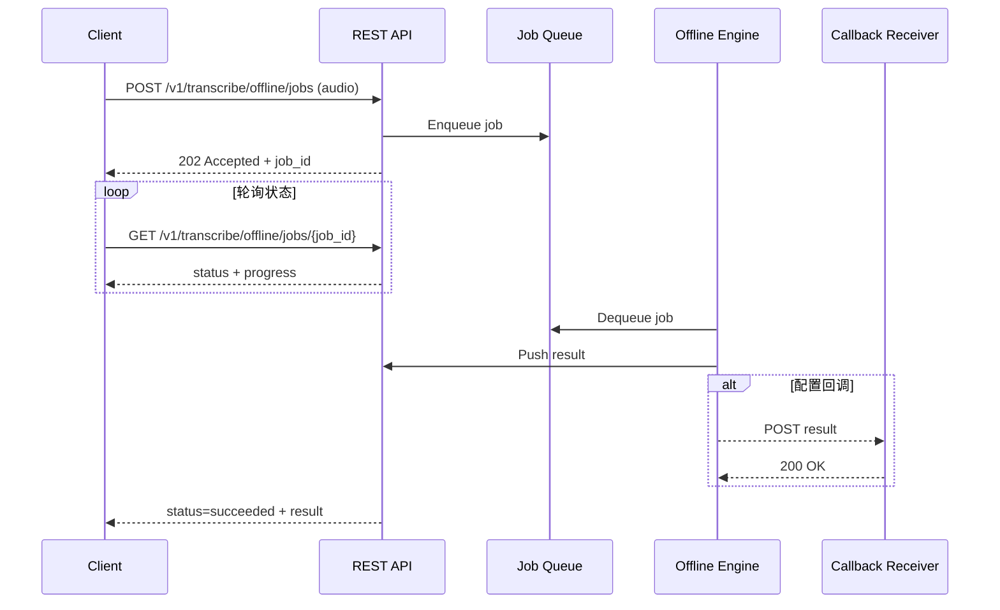
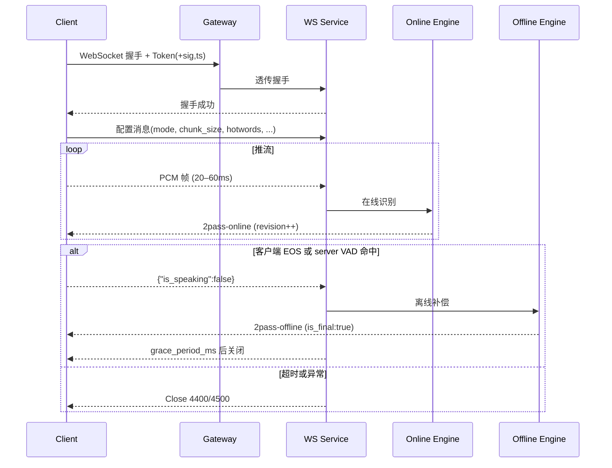
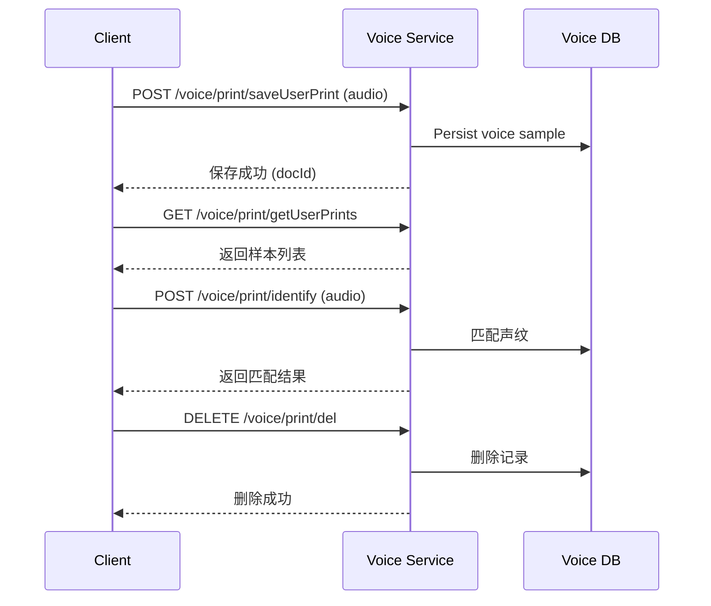

# 智能语音与声纹服务接口规范 v1.1

## 1. 概述
本规范统一描述语音识别（离线批量与实时流式）与声纹管理能力的开放接口，涵盖接入要求、请求/响应结构、示例以及错误码。除非特别说明，所有时间单位均为毫秒，布尔字段使用 `true/false` 表示。

- REST 离线识别：适用于整段音频文件的批量转写，可结合回调实现异步处理。
- WebSocket 实时识别：适用于实时字幕、会议记录等场景，支持 2pass（在线快速结果 + 离线补偿纠错）。
- 声纹管理接口：提供声纹注册、识别与管理能力。

## 2. 服务接入
### 2.1 域名与版本
- REST：`https://<your-domain>/v1`
- WebSocket：`wss://<your-domain>/v1`
- 主版本使用 `/v1` 前缀。新增字段需向后兼容；弃用字段需提前 1 个主版本标记 `@deprecated` 并保留至少 90 天。

### 2.2 鉴权与安全
- 令牌：Bearer Token（可采用 JWT 或网关签发的短期访问令牌）。
- 携带方式：
  - REST：`Authorization: Bearer <token>`。
  - WebSocket：握手时透传 `Authorization`；若客户端受限，可改用查询串 `?token=<token>` 并配合签名与时效验证。
- 防重放签名（可选）：在 Header 或查询参数携带 `ts=<unix秒>` 与 `sig=BASE64(HMAC_SHA256(token|ts, secret))`；超过设定窗口（如 60s）返回错误。
- 入口应结合 API 网关实现限流（QPS/并发）、来源 IP 白名单与审计日志。

### 2.3 幂等与请求标识
- REST 创建任务接口使用 `Idempotency-Key` 保证幂等：相同 Key + Body 在 60 分钟内返回同一 `job_id`。
- 所有请求应携带 `X-Request-ID` 以便日志追踪，并在响应中原样返回。

### 2.4 令牌获取
- 令牌由企业统一身份平台或 API 网关签发，通常通过 OAuth2 Client Credentials 或内部签发接口获得。
- 语音服务应分配独立的 `client_id`/`client_secret`，并限定可调用的接口范围。
- 典型流程：
  1. 向运维/平台管理员申请接入，获得 `client_id`、`client_secret` 与授权范围。
  2. 客户端在安全环境下调用认证端点：
     ```http
     POST https://<auth-domain>/oauth2/token
     Content-Type: application/x-www-form-urlencoded

     grant_type=client_credentials&client_id=<id>&client_secret=<secret>&scope=funasr.api
     ```
  3. 响应示例：
     ```json
     {
       "access_token": "eyJhbGciOi...",
       "token_type": "Bearer",
       "expires_in": 3600,
       "scope": "funasr.api"
     }
     ```
  4. 客户端在有效期内缓存 `access_token` 并在请求 Header 中携带 `Authorization: Bearer <token>`。
- 若采用网关签名模式，可通过运维端提供的工具生成短期 Token，或由业务系统在登录后颁发。不同部署环境可根据安全策略调整。

### 2.5 接口通用说明
- **编码**：除文件上传外，默认使用 `application/json` 与 UTF-8 编码。
- **时间字段**：统一使用 ISO8601 字符串（例如 `2025-01-21T08:00:00Z`）或毫秒时间戳（文中以 `_ms` 结尾字段表示）。
- **分页约定**：`page` 从 1 开始计数，`pageSize` 取值范围 10～100；响应体需返回 `total` 供前端计算。
- **错误结构**：
  ```json
  {"code": 50001, "message": "internal error", "request_id": "..."}
  ```
  `code` 为业务子码，`message` 提供文本描述，`request_id` 便于排查。
- **成功结构**：语音相关接口通常返回 `code=0` 或 `status` 字段，声纹管理接口遵循统一的 `Base` 模型（见 §7）。
- **安全要求**：所有接口需在 HTTPS/WSS 通道下访问，并实现 IP 白名单、速率限制与审计日志。

## 3. REST 离线识别
### 3.1 Endpoint
| 方法 | 路径 | 说明 |
|---|---|---|
| POST | `/v1/transcribe/offline/jobs` | 创建离线识别任务 |
| GET  | `/v1/transcribe/offline/jobs/{job_id}` | 查询任务状态与结果 |
| POST | `/v1/transcribe/offline/jobs/{job_id}/cancel`（可选） | 取消排队或执行中的任务 |

> 若内部仍使用旧路径，可由网关映射至上述外部路径。

### 3.2 创建任务（POST `/v1/transcribe/offline/jobs`）
**Headers**
  - `Authorization: Bearer <token>`（必填）
  - `Content-Type: multipart/form-data`
- `Idempotency-Key`（可选）

**Body（multipart）**
- `audio`（必填）：音频文件，支持 `wav/mp3/m4a/aac/flac` 等，推荐大小 ≤ 50MB。
- `language`（可选，默认 `zh-CN`）：目标识别语言。
- `itn`（可选，默认 `true`）：是否启用数值/日期等智能规范化。
- `hotwords`（可选）：热词 JSON，格式见 6.4。
- `extra`（可选）：透传元数据（JSON 字符串）。

**流程说明**
1. 服务校验令牌、文件大小与格式，若不符合要求返回 4xx。
2. 通过对象存储或临时目录安全保存音频文件，并记录上下文元数据。
3. 将任务指针写入消息队列，后台工作节点异步消费。
4. 同步响应中返回任务 ID、当前状态以及模型版本，便于后续查询或对账。

**响应示例**（HTTP 202）
```json
{ "job_id": "off-20250121-0001", "status": "queued", "engine_version": "funasr-2.0.1" }
```

### 3.3 查询任务（GET `/v1/transcribe/offline/jobs/{job_id}`）
**响应示例**
```json
{
  "job_id": "off-20250121-0001",
  "status": "succeeded",
  "progress": 1.0,
  "submitted_at": "2025-01-21T06:01:18Z",
  "completed_at": "2025-01-21T06:02:04Z",
  "result": {
    "text": "各位同事，大家好。……",
    "sentences": [
      {"text":"各位同事，大家好。","start_ms":0,"end_ms":2100}
    ],
    "language": "zh-CN",
    "engine_version": "funasr-2.0.1",
    "meta": {
      "audio_duration_ms": 183000,
      "unstable_rate": 0.08
    }
  }
}
```
- `progress`：0～1 之间的浮点数，用于展示后台处理进度。
- `result.sentences`：默认开启句级时间戳；如需关闭，可在创建任务时设置参数。
- `engine_version`：便于追踪不同模型或部署批次。

状态说明：`queued`、`processing`、`succeeded`、`failed`、`cancelled`。失败时返回 `error.code` 与 `error.message` 字段，例如 `{"code":50001,"message":"internal error"}`。

### 3.4 任务取消（POST `/v1/transcribe/offline/jobs/{job_id}/cancel`）
任务处于 `queued/processing` 时可取消。服务端校验任务可取消状态后，回写 `status` 并返回：
```json
{ "job_id": "off-20250121-0001", "status": "cancelled" }
```

### 3.5 回调（可选）
- Header：`X-Timestamp: <unix秒>`，`X-Signature: sha256=<base64(HMAC_SHA256(body, secret))>`。
- Body：与查询任务时 `result` 结构一致，可附带 `job_id`、`status` 等字段。
- 回调方需在 5 次以内（指数退避）完整消费通知，可使用 `Idempotency-Key` 或 `job_id` 去重，并返回 `2xx`。

### 3.6 REST 错误码
| HTTP | code | message | 说明 |
|---|---|---|---|
| 400 | 40001 | invalid audio format | 不支持的音频编码或采样率异常 |
| 401 | 40101 | invalid token | 令牌缺失、过期或校验失败 |
| 413 | 41301 | payload too large | 音频文件超过限制 |
| 429 | 42901 | rate limit exceeded | 排队溢出或触发限流 |
| 500 | 50001 | internal error | 服务内部错误 |
| 504 | 50401 | job timeout | 处理超时 |

### 3.7 离线任务时序


## 4. WebSocket 实时识别（2pass）
### 4.1 握手
- URL：`wss://<your-domain>/v1/transcribe/ws[?token=...]`
- 子协议：`binary`
- 流程：连接建立 → 客户端发送配置消息 → 推送音频帧 → 等待离线补偿。

### 4.2 配置消息（JSON）
```json
{
  "mode": "2pass",
  "audio_fs": 16000,
  "wav_name": "mic_session",
  "chunk_size": [5, 10, 5],
  "chunk_interval": 10,
  "language": "zh-CN",
  "itn": true,
  "hotwords": {
    "terms": [{"text":"心肌梗死","boost":6.0}],
    "ttl_ms": 600000
  },
  "vad_silence_ms": 800,
  "grace_period_ms": 200
}
```
> 会话内可再次发送配置消息进行热更新（如修改 `hotwords`、`chunk_size`、`language` 等）。

字段说明：
- `mode`：`2pass`（默认）同时开启在线与离线双路；`online` 或 `offline` 可单独启用。
- `chunk_size`：前/中/后窗口（毫秒），影响流式模型缓冲与延迟。
- `chunk_interval`：客户端推流间隔（毫秒），需与帧大小匹配。
- `hotwords`：可选热词配置，支持权重提升与 TTL（参见 §6.4）。
- `vad_silence_ms`：静默阈值，用于服务器端止语判定。
- `grace_period_ms`：发送最终结果后延迟关闭的缓冲时间，便于客户端完成收尾。

### 4.3 音频帧（Binary）
- PCM Little Endian，16-bit 单声道。
- 采样率需与 `audio_fs` 一致；严格模式下不一致将返回关闭码 4400 与 `{"code":440002,"message":"unsupported sample_rate"}`。
- 帧长度宜保持在 20–60 ms（推荐 40 ms ≈ 1280 samples ≈ 2560 bytes），消息频率 ≤ 50 条/秒，单帧 ≤ 16 KB。
- 对于浏览器端的分片，可通过 AudioWorklet/ScriptProcessor 进行缓冲并对齐推送。

### 4.4 控制消息（JSON）
- `{"is_speaking": false}`：显式 EOS，触发离线补偿，优先级最高。
- 热更新：配置同 4.2，可动态调整 `hotwords`、`language`、`itn` 等。
- 心跳：可发送 `{"ping": 1}`（≤ 1/20s），防止长时间静默被判定超时。

### 4.5 端点触发与关闭
- 触发离线补偿条件：
  1. 客户端发送 `is_speaking=false`（client EOS）。
  2. 连续静默超过 `vad_silence_ms`（默认 800ms），服务器自动止语。
- 服务端发送 `is_final: true` 的 `2pass-offline` 消息后进入 `grace_period_ms`（默认 200ms），随后可关闭连接；客户端亦可主动 `close`。
- 若需在同一连接内处理多段语音，可在离线结果返回后重新发送配置消息并继续推流。

### 4.6 消息协议契约
```json
{
  "mode": "2pass-online | 2pass-offline | online | offline",
  "revision": 7,
  "wav_name": "meeting_20250121",
  "text": "各位同事大家好",
  "patch": {
    "replace": [ { "range": [0, 6], "text": "各位同事，大家好" } ]
  },
  "t_audio_ms": 3520,
  "sentences": [
    {"text":"各位同事，大家好。","start_ms":0,"end_ms":2100}
  ],
  "is_final": false,
  "language": "zh-CN",
  "engine_version": "funasr-2.0.1",
  "meta": {"unstable_rate": 0.12}
}
```
- `revision`：递增版本号，前端按最大值去重去乱序。
- `patch`：可选差量；返回差量时同帧需同时提供 `text` 全量，便于低门槛接入。
- `sentences`：离线补偿阶段提供句级时间戳。
- `is_final`：仅在离线最终结果发送时为 `true`，其余阶段为 `false`。

**在线示例**
```json
{"mode":"2pass-online","revision":5,"text":"各位同事大家","t_audio_ms":1680,"is_final":false}
```

**离线最终示例**
```json
{"mode":"2pass-offline","revision":12,"text":"各位同事，大家好。","sentences":[{"text":"各位同事，大家好。","start_ms":0,"end_ms":2100}],"is_final":true}
```

### 4.7 热词配置
```json
"hotwords": {
  "terms": [
    {"text": "心肌梗死", "boost": 6.0},
    {"text": "冠状动脉", "boost": 4.0}
  ],
  "ttl_ms": 600000,
  "strategy": "replace"
}
```
- `strategy`: `replace`（整包覆盖）或 `merge`（增量合并）。
- `ttl_ms`: 有效期，过期后恢复默认模型热词；未提供时热词持久有效。
- 会话内热更新需附带完整热词列表，以避免语义不一致。

### 4.8 超时、心跳与会话时长
- `idle_audio_timeout_ms = 5000`：超过该时间未收到音频/控制消息 → 关闭（4400）。
- `max_session_ms = 300000`（5 分钟）：达到上限 → 关闭（4400），返回最后已完成结果。
- 客户端应实现 WebSocket `ping/pong`（20–30s），并处理服务器关闭后的重连流程。

### 4.9 错误码映射
| 场景 | HTTP | WS Close | 业务子码 | 说明 |
|---|---|---|---|---|
| 参数/帧错误 | 400 | 4400 | 440001/440002 | JSON 解析失败 / 采样率不支持 |
| 鉴权失败 | 401 | 4401 | 40101 | Token 无效或过期 |
| 限流/并发 | 429 | 4290 | 42901 | 超出配额或并发上限 |
| 服务器异常 | 500 | 4500 | 50001 | 内部错误，需重试 |

**统一错误体**
```json
{"code": 440001, "message": "invalid frame", "request_id": "..."}
```

### 4.10 实时识别时序


## 5. 声纹管理 API
### 5.1 公共说明
- 基础路径：`/voice/print`
- 认证：同 2.2。
- 数据格式：默认 `application/json`；上传音频使用 `multipart/form-data` 或 `application/x-www-form-urlencoded` 中的文件字段。
- 幂等性：查询接口为幂等操作；删除/保存接口可结合 `Idempotency-Key` 或外部业务主键避免重复处理。
- 业务约束：声纹样本需满足最短 1 秒、最长 30 秒的音频长度，采样率不少于 16 kHz 单声道。
- 常见错误码：
  | code | message | 说明 |
  |---|---|---|
  | 40101 | invalid token | 令牌无效或过期 |
  | 40011 | invalid voice sample | 音频时长/格式不符合要求 |
  | 40401 | user not found | 指定的用户不存在 |
  | 40901 | voiceprint conflict | 声纹重复或冲突 |
  | 50002 | voice service error | 声纹引擎执行失败 |

### 5.2 使用流程概览


### 5.3 删除用户声纹（DELETE `/voice/print/del`）
**请求体（application/json）**
```json
{
  "docId": "string",
  "userId": 10001
}
```

**字段说明**
- `docId`：声纹样本文档 ID，用于定位待删除的音频。
- `userId`：业务系统内的用户 ID，需与声纹所属用户一致。

**业务说明**
- 删除操作需具备声纹管理权限。
- 若指定 `docId` 不存在或不属于该用户，接口返回 `40401`。
- 删除成功不返回数据，客户端可通过查询接口验证。

**响应体**
```json
{
  "appName": "app",
  "code": 200,
  "data": {},
  "message": "success",
  "success": true,
  "time": 1761039207689,
  "traceId": "efc1cea2"
}
```

### 5.4 获取用户列表（GET `/voice/print/getUserList`）
**用途**：提供具备声纹注册权限的业务用户列表，便于选择目标用户进行声纹录入。

**查询参数**
| 参数 | 说明 | 必填 | 类型 | 默认 |
|---|---|---|---|---|
| `page` | 页码 | 否 | int64 | 1 |
| `pageSize` | 页大小 | 否 | int64 | 10 |
| `name` | 用户名模糊搜索 | 否 | string | - |

**响应体**
```json
{
  "appName": "app",
  "code": 200,
  "data": {
    "items": [
      {
        "id": 0,
        "name": "",
        "username": "",
        "mobile": "",
        "status": 0,
        "company": "",
        "createTime": {},
        "updateTime": {}
      }
    ],
    "page": 1,
    "pageSize": 10,
    "total": 0
  },
  "message": "success",
  "success": true,
  "time": 1761039207689,
  "traceId": "578d91fe"
}
```
- 响应字段可根据业务需要补充，例如 `roles`、`lastLoginTime`，敏感信息应按合规要求脱敏。

### 5.5 获取用户声纹列表（GET `/voice/print/getUserPrints`）
**用途**：查询指定用户已注册的声纹样本，查看样本状态与文本内容。

**查询参数**
| 参数 | 说明 | 必填 | 类型 | 默认 |
|---|---|---|---|---|
| `userId` | 用户 ID | 是 | int64 | - |
| `page` | 页码 | 否 | int64 | 1 |
| `pageSize` | 页大小 | 否 | int64 | 10 |

**响应体**
```json
{
  "appName": "app",
  "code": 200,
  "data": {
    "items": [
      {
        "id": "",
        "userid": 0,
        "username": "",
        "txt": "",
        "wav_path": "",
        "create_time": 0
      }
    ],
    "page": 1,
    "pageSize": 10,
    "total": 0
  },
  "message": "success",
  "success": true,
  "time": 1761039207689,
  "traceId": "c0185169"
}
```
- `wav_path`：相对路径，客户端需拼接接口域名与用户 ID 获取下载地址。
- `txt`：声纹采集时的文本提示，可用于质检或再训练场景。
- 可扩展 `status` 字段表示审核状态（例如 `pending`、`approved`、`rejected`）。

### 5.6 声纹鉴定（POST `/voice/print/identify`）
**用途**：上传音频进行声纹比对，返回匹配的用户信息及文本内容。

**表单字段（application/x-www-form-urlencoded 或 multipart）**
| 字段 | 说明 | 必填 | 类型 |
|---|---|---|---|
| `audio` | 待鉴定音频文件 | 是 | file |

**响应体**
```json
{
  "appName": "app",
  "code": 200,
  "data": {
    "txt": "",
    "user": {
      "id": 0,
      "name": "",
      "mobile": ""
    },
    "score": 0.92,
    "threshold": 0.85
  },
  "message": "success",
  "success": true,
  "time": 1761039207689,
  "traceId": "926f6fdc"
}
```
- `score`：匹配得分（0–1）用于判断相似度。
- `threshold`：系统当前命中的阈值，可根据业务级别调整。
- 若未匹配到用户，返回 `code=40401`、`message="user not found"`，`data` 为 `null`。

### 5.7 保存用户声纹（POST `/voice/print/saveUserPrint`）
**用途**：为指定用户创建或追加声纹样本。

**表单字段**
| 字段 | 说明 | 必填 | 类型 |
|---|---|---|---|
| `userId` | 用户 ID | 是 | int |
| `userName` | 用户姓名 | 是 | string |
| `audio` | 声纹样本音频 | 是 | file |

**响应体** 同 5.3。
- 音频需满足采样率、时长约束，不符合要求时返回 `code=40011`。
- 存储前可对音频进行归一化处理（采样率、时长），并记录 `docId` 以便后续删除或更新。
- 重复上传同一用户声纹时，需按业务规则指定覆盖或追加策略，冲突时返回 `40901`。

### 5.8 声纹接口错误码
| 场景 | HTTP | code | message | 说明 |
|---|---|---|---|---|
| 鉴权失败 | 401 | 40101 | invalid token | 令牌缺失、过期或不合法 |
| 样本不合法 | 400 | 40011 | invalid voice sample | 音频编码、时长或信噪比不符合要求 |
| 用户不存在 | 404 | 40401 | user not found | 目标用户不存在或已被禁用 |
| 声纹冲突 | 409 | 40901 | voiceprint conflict | 用户已存在相同声纹或冲突样本 |
| 引擎异常 | 500 | 50002 | voice service error | 声纹识别引擎内部错误 |

## 6. 错误码补充（声纹管理）
声纹管理接口统一返回 `Base` 结构：
```json
{
  "appName": "app",
  "code": 200,
  "data": {},
  "message": "success",
  "success": true,
  "time": 1761039207689,
  "traceId": "efc1cea2"
}
```
- `code`：200 或 0 表示成功；其他值对应业务错误，需结合 `message` 与日志定位。
- 发生鉴权错误时返回 401，参数校验错误返回 400；约束违规时可返回 422 并在 `message` 中说明原因。
- 高频错误码（如 42901、50001）需建立监控告警，以便及时发现调用风险。

## 7. 监控与运维
- 指标：实时延迟（online、offline）、离线补偿耗时、字错率（CER/WER）、VAD 命中率、掉线率、限流命中率。
- 日志：记录 `request_id`、鉴权结果、错误码、`revision` 序列及热词变更；对于声纹操作需记录操作人、目标用户与动作类型。
- 运维策略：采用灰度放量（1%→10%→100%），收集 `revision` 抖动、离线补偿时延与 VAD 误检率，确认稳定后再开放给第三方。

## 8. 版本与兼容策略
- 所有新增字段默认可忽略；客户端未识别的字段应安全忽略。
- 弃用字段需在响应中保留 `@deprecated` 标记，并通过发布说明提前告知。
- 版本升级时同步更新 SDK/示例代码，并提供兼容性测试清单，便于集成方快速校验功能。

