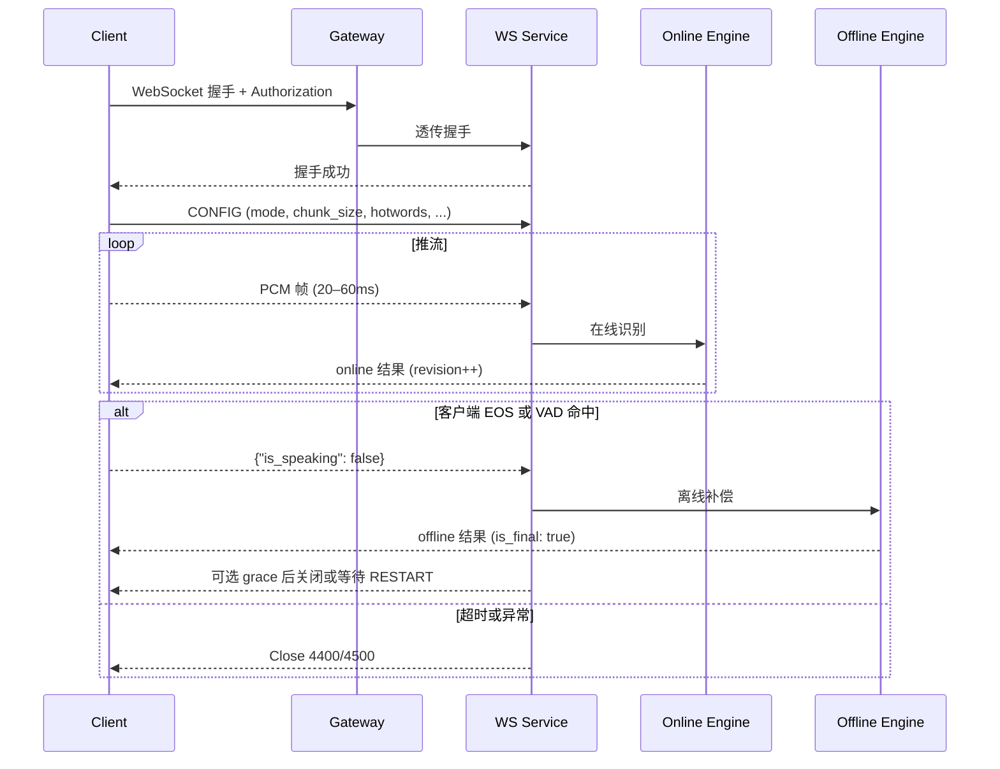

# 智能语音与声纹服务接口规范 v1.1（修订提议，无签名 / 无 SLA 版）

> 说明：本修订版仅做**协议风格统一、边界清晰化与可落地性增强**；按你的要求：**去掉签名**、**不写 SLA**。若与 v1 存在冲突，以本修订为准。

---

## 0. 全局规范（新增）

**统一响应结构**（REST 与 WS 业务消息一致）：

```json
{
  "code": 0,
  "message": "ok",
  "data": {},
  "request_id": "uuid"
}
```

* 成功恒为 `code=0`，失败 `code>0`；HTTP 仅表达传输语义（4xx/5xx），业务错误落在 `code`。
* 分页统一字段：`page`（页码，默认 1）、`pageSize`（页大小，默认 10）、`total`（总数）、`items`（结果数组）。
* 时间统一：**毫秒整数**（字段以 `_ms` 结尾），外显/日志可并行输出 ISO8601 UTC。
* 所有响应回显 `request_id`（同请求头 `X-Request-ID`）。

---

## 1. 概述（延续 v1，不改）

* 语音识别（离线/实时 2pass）；声纹管理能力。时间单位默认为毫秒，布尔为 `true/false`。

---

## 2. 服务接入

### 2.1 域名与版本（维持）

* REST：`https://<domain>/v1` ；WS：`wss://<domain>/v1`

### 2.2 鉴权与安全（**重写，去掉签名**）

* **令牌**：内部系统使用 **Bearer Token**（JWT 或网关短期令牌）。
* **携带方式**：

  * REST：`Authorization: Bearer <token>`
  * WebSocket：握手 Header 透传 `Authorization`。如环境受限，可改用查询串 `?token=<token>`（**不建议**）。
* **网关建议**：启用限流、来源 IP 白名单、审计日志（不涉及 SLA）。

### 2.3 幂等与请求标识（**细化**）

* **Idempotency-Key**（仅对“创建类接口”）：

  * 作用域：`tenant + path`
  * TTL：60 分钟
  * 服务端保存 `SHA256(normalized_body)`，命中返回首次响应（`job_id` 等）。
* **X-Request-ID**：客户端生成并在响应中回显；服务端兜底生成 UUID。

### 2.4 令牌获取（内部约定，保持简略）

* 由统一身份平台或 API 网关发放（Client Credentials 或内部发号器）。

---

## 4. WebSocket 实时识别（2pass）

### 4.1 建连与握手（简化）

* URL：`wss://<domain>/v1/asr/stream`
* Header：`Authorization: Bearer <token>`、`X-Request-ID`（可选）
* 子协议：`binary` 或 `json`

### 4.2 业务消息与帧约束

* 音频：单声道 PCM，采样率 16/8 kHz，帧长 20–60ms，单帧 ≤ 16KB。
* 速率：建议 ≤ 50 帧/秒；超速可能被节流或关闭。

### 4.3 会话状态机（**新增**）

状态：`INIT → STREAMING → EOS → OFFLINE_COMP → FINAL → (RESTART|CLOSE)`

* `INIT`：握手成功；仅允许发送 `CONFIG` 或开始音频。
* `STREAMING`：持续推流，服务端输出 `online` 增量结果（带 `revision`）。
* `EOS`：客户端发送 `{ "is_speaking": false }` 或命中服务端 VAD 停止点。
* `OFFLINE_COMP`：服务端进行离线补偿，输出 `offline` 结果（`is_final=true`）。
* `FINAL`：会话完成。可选择 `RESTART`（新一轮语音，复用同会话）或 `CLOSE`。

**约束与错误**：

* 在 `OFFLINE_COMP` 未完成前，若再次收到 `EOS` 或新的音频帧 → 返回 `code=440003`（busy）。
* 客户端按最大 `revision` 去重；`patch` 到达时，先用最近一次的全量 `text` 覆盖，再顺序应用差量。

### 4.4 热词配置（保持，补充一致性）

```json
"hotwords": {
  "terms": [ {"text": "心肌梗死", "boost": 6.0} ],
  "ttl_ms": 600000,
  "strategy": "replace"
}
```

* 每次会话内热更新需发送**完整列表**；服务端产生 `cfg_rev` 并在结果中回显，用于客户端一致性判断和回滚。

### 4.5 超时、心跳与会话时长（对齐）

* `idle_audio_timeout_ms = 5000`：超时未收音频/控制 → 关闭（WS Close 4400）。
* `max_session_ms = 300000`：到达上限 → 关闭（4400），先返回最后完成结果。
* 客户端实现 WS `ping/pong`（20–30s），处理关闭后的重连。

### 4.6 背压与节流（**新增**）

* 服务端队列积压超阈值时发送：

```json
{"code": 42901, "message": "rate limit exceeded", "meta": {"suggest_fps": 25}}
```

* 若持续超限 T 毫秒，服务器可主动关闭（WS Close `4290`）。

### 4.7 错误码映射（统一口径）

| 场景     | HTTP | WS Close | 业务子码   | 说明                 |
| ------ | ---- | -------- | ------ | ------------------ |
| 参数/帧错误 | 400  | 4400     | 440001 | JSON 解析失败 / 采样率不支持 |
| 鉴权失败   | 401  | 4401     | 40101  | Token 无效或过期        |
| 限流/并发  | 429  | 4290     | 42901  | 超出并发/配额            |
| 服务器异常  | 500  | 4500     | 50001  | 内部错误，建议重试          |

**统一错误体示例**：

```json
{"code": 440001, "message": "invalid frame", "request_id": "uuid"}
```

### 4.8 实时识别时序（mermaid，**去掉签名字段**）



---

## 5. 声纹管理 API（统一响应与分页风格）

### 5.1 公共说明

* 基础路径：`/voice/print`
* 认证：`Authorization: Bearer <token>`（与 2.2 一致）
* 数据格式：默认 `application/json`；上传音频使用 `multipart/form-data` 或 `application/x-www-form-urlencoded` 文件字段。
* 幂等性：查询类天然幂等；写操作可结合 `Idempotency-Key` 或外部业务主键避免重复。

### 5.2 获取用户列表（示例响应统一化）

**响应体（示例）**

```json
{
  "code": 0,
  "message": "ok",
  "request_id": "uuid",
  "data": {
    "items": [
      {"id": 1, "username": "张三", "status": 0, "company": "", "createTime": 0, "updateTime": 0}
    ],
    "page": 1,
    "pageSize": 10,
    "total": 1
  }
}
```

### 5.3 获取用户声纹列表（GET `/voice/print/getUserPrints`）

**响应体（示例）**

```json
{
  "code": 0,
  "message": "ok",
  "request_id": "uuid",
  "data": {
    "items": [
      {"id": "doc-1", "userid": 1001, "username": "张三", "txt": "提示词", "wav_path": "/p/1.wav", "create_time": 1690000000000}
    ],
    "page": 1,
    "pageSize": 10,
    "total": 1
  }
}
```

* `wav_path` 为相对路径，由客户端拼接域名与用户标识生成下载地址。

### 5.4 声纹鉴定（POST `/voice/print/identify`）

**响应体（统一化）**

```json
{
  "code": 0,
  "message": "ok",
  "request_id": "uuid",
  "data": {
    "txt": "可选返回的文本",
    "user": {"id": 1001, "name": "张三", "mobile": ""},
    "score": 0.92,
    "threshold": 0.85
  }
}
```

* 未匹配到用户：返回 `code=40401`、`message="user not found"`，`data=null`。

### 5.5 保存用户声纹（POST `/voice/print/saveUserPrint`）

**响应体（统一化）**

```json
{
  "code": 0,
  "message": "ok",
  "request_id": "uuid",
  "data": {"docId": "doc-1"}
}
```

* 不符合采样率/时长约束：`code=40011`。
* 重复策略冲突：`code=40901`。

---

## 6. 兼容与集成建议（简要）

* 浏览器端：推荐 AudioWorklet 推流；如需跨域，开放相应 CORS/WS-CORS。
* 示例 SDK：Node/Java/Python/Web（覆盖握手、热更新、EOS、掉线重连、背压节流）。

---

## 7. 变更摘要（对比 v1）

* 去掉签名相关描述；保留 Bearer Token。
* 统一响应包、错误码表与分页字段。
* 新增 WS 会话状态机、背压与节流规范；时序图去掉签名字段。
* 统一声纹接口响应风格，与识别接口一致。
