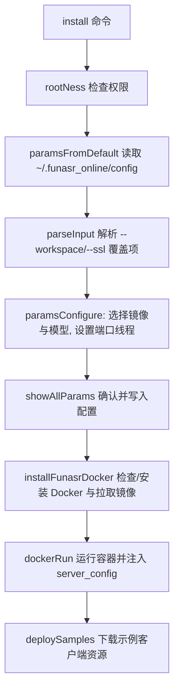

# funasr-runtime-deploy-online-cpu-zh.sh 使用说明

`funasr-runtime-deploy-online-cpu-zh.sh` 是 FunASR 官方提供的一键化部署脚本，用于在 CPU 服务器上快速安装并运维面向中文实时识别的 Runtime Docker 服务。脚本内置远程镜像列表、默认模型组合、示例客户端与运行时配置模板，可在一次交互中完成 Docker 环境检查、参数确认、容器启动以及演示工程准备等操作。【F:runtime/deploy_tools/funasr-runtime-deploy-online-cpu-zh.sh†L3-L49】【F:runtime/deploy_tools/funasr-runtime-deploy-online-cpu-zh.sh†L317-L360】【F:runtime/deploy_tools/funasr-runtime-deploy-online-cpu-zh.sh†L933-L1020】

## 默认目录与配置产物

- **工作空间**：默认在执行目录下创建 `funasr-runtime-resources`，用于缓存模型与示例代码；首次初始化也会保证 `${workspace}/models`、`${workspace}/samples` 等子目录存在。【F:runtime/deploy_tools/funasr-runtime-deploy-online-cpu-zh.sh†L33-L49】【F:runtime/deploy_tools/funasr-runtime-deploy-online-cpu-zh.sh†L353-L360】
- **配置目录**：全局配置位于 `~/.funasr_online/`（若无法定位 `$HOME` 会退回 `/var/funasr`），其中包括参数快照 `config`、容器启动 JSON `server_config`、进度文件 `progress.txt` 与服务日志 `server_console.log`。【F:runtime/deploy_tools/funasr-runtime-deploy-online-cpu-zh.sh†L317-L343】
- **默认模型**：脚本预置 Paraformer（ASR）、FSMN VAD 与 CT-Transformer 标点模型 ID，可在首次安装时直接加载，也可在更新阶段切换或替换成本地路径。【F:runtime/deploy_tools/funasr-runtime-deploy-online-cpu-zh.sh†L1533-L1548】【F:runtime/deploy_tools/funasr-runtime-deploy-online-cpu-zh.sh†L1217-L1288】

## `install` 流程总览

执行 `sudo bash funasr-runtime-deploy-online-cpu-zh.sh install` 会按 6 个阶段引导用户完成部署，整体流程如下图所示：

### 0/6：权限检查
脚本首先调用 `rootNess`，提醒必须以 root 或具备 sudo 能力的账号运行，并在检测到 `sudo` 缺失时自动回退为裸命令执行。【F:runtime/deploy_tools/funasr-runtime-deploy-online-cpu-zh.sh†L428-L445】

### 1/6：选择 Docker 镜像
`selectDockerImages` 会从阿里云 OSS 与 GitHub 镜像列表之间切换重试，获取可用的 Runtime 镜像版本，再通过交互式菜单让用户选定目标镜像并校验当前容器状态是否冲突。【F:runtime/deploy_tools/funasr-runtime-deploy-online-cpu-zh.sh†L381-L489】

### 2/6：选择模型组合
脚本根据镜像列表中的推荐项填充 ASR、VAD、标点模型数组，逐项提示用户选择 ModelScope 模型 ID，所选参数会用于后续自动下载或绑定本地模型目录。【F:runtime/deploy_tools/funasr-runtime-deploy-online-cpu-zh.sh†L491-L535】【F:runtime/deploy_tools/funasr-runtime-deploy-online-cpu-zh.sh†L578-L601】

### 3/6：端口与线程设置
`setupHostPort` 要求输入宿主机开放端口（默认 10095），并与容器内端口映射。随后 `complementParameters` 会依据历史记录或 CPU 核数推断解码线程数，并自动给出 I/O 线程的 1/4 值（最小为 1），确保容器启动时具备合理并发配置。【F:runtime/deploy_tools/funasr-runtime-deploy-online-cpu-zh.sh†L537-L616】

### 4/6：参数确认与配置生成
在 `showAllParams` 中，脚本按类别列出 Docker 镜像、工作空间、模型映射、线程/端口与 SSL 标志等配置，要求用户确认后才会写入 `config` 并生成 `server_config` JSON（其中包括执行程序路径、模型目录、端口和证书开关）。【F:runtime/deploy_tools/funasr-runtime-deploy-online-cpu-zh.sh†L762-L861】【F:runtime/deploy_tools/funasr-runtime-deploy-online-cpu-zh.sh†L717-L760】【F:runtime/deploy_tools/funasr-runtime-deploy-online-cpu-zh.sh†L1022-L1069】

### 5/6：Docker 安装与镜像拉取
`installFunasrDocker` 负责检测 Docker 是否已安装；若缺失，则按不同 Linux 发行版执行官方安装脚本，并在成功后拉取所选 FunASR 镜像。无论是否新装，都会调用 `docker pull` 同步最新镜像层。【F:runtime/deploy_tools/funasr-runtime-deploy-online-cpu-zh.sh†L865-L931】

### 6/6：容器运行与示例准备
`dockerRun` 会构造 `docker run` 命令，挂载配置目录与模型缓存、注入 `DAEMON_SERVER_CONFIG` 环境变量、启动 2pass WebSocket 服务，随后下载示例资源并提示如何调用 `client` 子命令体验 Python/C++ 客户端。启动过程中还会清理历史进度/日志文件，记录新的容器 ID 并持久化参数。【F:runtime/deploy_tools/funasr-runtime-deploy-online-cpu-zh.sh†L933-L1020】【F:runtime/deploy_tools/funasr-runtime-deploy-online-cpu-zh.sh†L1120-L1148】【F:runtime/deploy_tools/funasr-runtime-deploy-online-cpu-zh.sh†L1328-L1404】

## 服务生命周期命令

脚本内置与服务管理相关的子命令，均需 root 或 sudo 权限：

| 命令 | 说明 | 关键动作 |
| --- | --- | --- |
| `install` | 交互式安装并启动容器，可通过 `--workspace`、`--ssl` 覆盖默认值 | 读取历史配置、提示参数、保存设置、安装 Docker、运行容器并准备示例资源。【F:runtime/deploy_tools/funasr-runtime-deploy-online-cpu-zh.sh†L1563-L1596】 |
| `start` | 在保持现有配置的情况下启动（或重试启动）容器 | 展示当前参数、调用 `docker restart` 并在必要时重试。【F:runtime/deploy_tools/funasr-runtime-deploy-online-cpu-zh.sh†L1598-L1623】 |
| `restart` | 停止后重新启动容器 | 先 `docker stop` 再 `docker restart`，附带重试逻辑。【F:runtime/deploy_tools/funasr-runtime-deploy-online-cpu-zh.sh†L1624-L1650】 |
| `stop` | 停止当前容器 | 依据配置中的 Docker ID 调用 `docker stop`。【F:runtime/deploy_tools/funasr-runtime-deploy-online-cpu-zh.sh†L1651-L1655】【F:runtime/deploy_tools/funasr-runtime-deploy-online-cpu-zh.sh†L1196-L1204】 |
| `remove` | 停止并删除容器，同时清理配置文件 | `docker rm` 后删除 `config`、`server_config`，实现彻底卸载。【F:runtime/deploy_tools/funasr-runtime-deploy-online-cpu-zh.sh†L1656-L1663】【F:runtime/deploy_tools/funasr-runtime-deploy-online-cpu-zh.sh†L1206-L1214】 |
| `update` | 在线调整模型、线程、端口、工作空间或 SSL 设置，随后重启容器 | 支持指定 ModelScope ID 或本地路径，并自动更新配置与挂载；如参数缺失会打印帮助信息。【F:runtime/deploy_tools/funasr-runtime-deploy-online-cpu-zh.sh†L1664-L1723】【F:runtime/deploy_tools/funasr-runtime-deploy-online-cpu-zh.sh†L1217-L1326】 |
| `client` | 下载示例资源并引导运行 Python/C++ 客户端 | 根据选择安装依赖、收集服务地址后执行对应示例程序。【F:runtime/deploy_tools/funasr-runtime-deploy-online-cpu-zh.sh†L1724-L1729】【F:runtime/deploy_tools/funasr-runtime-deploy-online-cpu-zh.sh†L1328-L1404】 |
| `show` | 查看当前保存的所有参数 | 以只读模式运行 `showAllParams`，不写入配置。【F:runtime/deploy_tools/funasr-runtime-deploy-online-cpu-zh.sh†L1730-L1734】 |

通过 `-h/--help` 可以查看完整命令行选项与脚本版本信息。【F:runtime/deploy_tools/funasr-runtime-deploy-online-cpu-zh.sh†L1423-L1451】

## 模型与参数更新机制

- **模型切换**：`update --asr_model/--vad_model/--punc_model` 可接受 ModelScope 模型 ID 或本地目录。脚本会判断传入路径是否存在，若为本地目录则挂载到容器并清空对应模型 ID，避免重复下载。【F:runtime/deploy_tools/funasr-runtime-deploy-online-cpu-zh.sh†L1217-L1288】
- **线程与端口**：通过 `--decode_thread_num`、`--io_thread_num`、`--host_port`、`--docker_port` 可即时修改线程或端口，脚本会校验范围（线程 1~1024、端口 1~65536）后更新配置再重启。【F:runtime/deploy_tools/funasr-runtime-deploy-online-cpu-zh.sh†L1290-L1326】【F:runtime/deploy_tools/funasr-runtime-deploy-online-cpu-zh.sh†L1668-L1718】
- **SSL 开关**：`--ssl 0/1` 控制容器内是否加载默认证书文件 `/workspace/FunASR/runtime/ssl_key/server.{crt,key}`，关闭时将对应参数置空。【F:runtime/deploy_tools/funasr-runtime-deploy-online-cpu-zh.sh†L1057-L1065】【F:runtime/deploy_tools/funasr-runtime-deploy-online-cpu-zh.sh†L1683-L1689】
- **工作空间迁移**：`--workspace` 会被解析为绝对路径，必要时自动创建目录并在更新后重新挂载到容器。【F:runtime/deploy_tools/funasr-runtime-deploy-online-cpu-zh.sh†L300-L314】【F:runtime/deploy_tools/funasr-runtime-deploy-online-cpu-zh.sh†L1668-L1682】

更新完成后，脚本会重新计算模型与线程参数、保存配置并重启容器，失败时最多重试 10 次以保证服务恢复。【F:runtime/deploy_tools/funasr-runtime-deploy-online-cpu-zh.sh†L1697-L1722】

## 示例客户端与依赖

首次启动或执行 `client` 子命令时，脚本会下载 `funasr_samples` 压缩包、解压到工作空间，并按所选语言安装依赖：

- Python 客户端：安装 `click`、示例 `requirements_client.txt`、`ffmpeg` 及 `ffmpeg-python`，随后运行 `funasr_wss_client.py` 连接当前服务；
- Linux C++ 客户端：直接调用已编译的 `funasr-wss-client` 与示例音频。

脚本还会提示用户输入服务 IP、端口与音频路径，默认读取配置文件中的最新端口与示例音频。所有步骤均在同一命令内自动完成，方便验证部署结果。【F:runtime/deploy_tools/funasr-runtime-deploy-online-cpu-zh.sh†L1072-L1136】【F:runtime/deploy_tools/funasr-runtime-deploy-online-cpu-zh.sh†L1328-L1404】

## 日志、进度与排障

- **进度跟踪**：容器启动时会删除历史 `progress.txt` 与 `server_console.log` 并等待新文件生成，脚本内部提供 `serverProgress` 方法解析各模型下载进度，可用于自定义调试。【F:runtime/deploy_tools/funasr-runtime-deploy-online-cpu-zh.sh†L60-L157】【F:runtime/deploy_tools/funasr-runtime-deploy-online-cpu-zh.sh†L974-L984】
- **日志位置**：Runtime 日志默认写入 `~/.funasr_online/server_console.log`，可在部署失败时检查；若需要重新初始化，只需执行 `remove` 清理容器并删除 `config`、`server_config` 即可重新开始。【F:runtime/deploy_tools/funasr-runtime-deploy-online-cpu-zh.sh†L317-L343】【F:runtime/deploy_tools/funasr-runtime-deploy-online-cpu-zh.sh†L1656-L1663】
- **容器状态**：`dockerStop`、`dockerRemove`、`getDockerId` 等辅助函数会根据保存的 Docker ID 操作容器，确保生命周期命令始终针对最新实例。【F:runtime/deploy_tools/funasr-runtime-deploy-online-cpu-zh.sh†L1120-L1204】

通过以上说明，即可结合脚本交互界面理解整套在线 CPU 中文服务的部署逻辑，并在生产环境中快速执行安装、更新与验收流程。
